# Глава 1. Първи стъпки в програмирането

В тази глава ще разберем **какво е програмирането** в неговата същина. Ще се запознаем с идеята за **програмни езици** и ще разгледаме **средите за разработка на софтуер** (IDE) и как да работим с тях, в частност с **IntelliJ IDEA**. Ще напишем и изпълним **първата си програма** на програмния език **Java**, а след това ще се упражним с няколко задачи: ще създадем конзолна програма, графично приложение и уеб приложение. Ще се научим как да проверяваме за коректност решенията на задачите от тази книга в **Judge системата на СофтУни** и накрая ще се запознаем с типичните грешки, които често се допускат при писането на код и как да се предпазим от тях.

## Видео

<div class="video-player">
  Гледайте видеоурок по тази глава тук: <a target="_blank"
  href="https://www.youtube.com/watch?v=sU_JUiersZg">
  https://www.youtube.com/watch?v=sU_JUiersZg</a>.
</div>
<script src="/assets/js/video.js"></script>

## Какво означава "да програмираме"?

**Да програмираме** означава да даваме команди на компютъра какво да прави, например "*да отпечата нещо на екрана*" или "*да умножи две числа*". Когато командите са няколко една след друга, те се наричат **компютърна програма**. Текстът на компютърните програми се нарича **програмен код** (или **сорс код** или за по-кратко **код**).

### Компютърни програми

**Компютърните програми** представляват **поредица от команди**, които се изписват на предварително избран **език за програмиране**, например Java, C#, JavaScript, Python, Ruby, PHP, C, C++, Swift, Go или друг. За да пишем команди, трябва да знаем **синтаксиса и семантиката на езика**, с който ще работим, в нашия случай **Java**. Затова ще се запознаем със синтаксиса и семантиката на езика Java и с програмирането като цяло в настоящата книга, изучавайки стъпка по стъпка писането на код, от по-простите към по-сложните програмни конструкции.

### Алгоритми

Компютърните програми обикновено изпълняват някакъв алгоритъм. **Алгоритмите** са последователност от стъпки, необходими за да се свърши определена работа и да се постигне някакъв очакван резултат, нещо като "рецепта". Например, ако пържим яйца, ние изпълняваме някаква рецепта (алгоритъм): загряваме мазнина в някакъв съд, чупим яйцата, изчакваме докато се изпържат, отместваме от огъня. Аналогично, в програмирането **компютърните програми изпълняват алгоритми**: поредица от команди, необходими, за да се свърши определена работа. Например, за да се подредят поредица от числа в нарастващ ред, е необходим алгоритъм, примерно да се намери най-малкото число и да се отпечата, от останалите числа да се намери отново най-малкото число и да се отпечата и това се повтаря, докато числата свършат.

За удобство при създаването на програми, за писане на програмен код (команди), за изпълнение на програмите и за други операции, свързани с програмирането, ни е необходима и **среда за разработка**, например IntelliJ IDEA.

### Езици за програмиране, компилатори, интерпретатори и среди за разработка

**Езикът за програмиране** е изкуствен език (синтаксис за изразяване), предназначен за **задаване на команди**, които искаме компютърът да прочете, обработи и изпълни. Чрез езиците за програмиране пишем поредици от команди (**програми**), които **задават какво да прави компютъра**. Изпълнението на компютърните програми може да се реализира с **компилатор** или с **интерпретатор**.

**Компилаторът** превежда кода от програмен език на **машинен код**, като за всяка от конструкциите (командите) в кода избира подходящ, предварително подготвен фрагмент от машинен код, като междувременно **проверява за грешки текста на програмата**. Заедно компилираните фрагменти съставят програмата в машинен код, както я очаква микропроцесорът на компютъра. След като е компилирана програмата, тя може да бъде директно изпълнена от микропроцесора в кооперация с операционната система. При компилируемите езици за програмиране **компилирането на програмата** се извършва задължително преди нейното изпълнение и по време на компилация се откриват синтактичните грешки (грешно зададени команди). С компилатор работят езици като C++, C#, Java, Swift и Go.

Някои езици за програмиране не използват компилатор, а се **интерпретират директно** от специализиран софтуер, наречен "интерпретатор". **Интерпретаторът** е "**програма за изпълняване на програми**", написани на някакъв програмен език. Той изпълнява командите на програмата една след друга, като разбира не само от единични команди и поредици от команди, но и от другите езикови конструкции (проверки, повторения, функции и т.н.). Езици като PHP, Python и JavaScript работят с интерпретатор и се изпълняват без да се компилират. Поради липса на предварителна компилация, при интерпретируемите езици **грешките се откриват по време на изпълнение**, след като програмата започне да работи, а не предварително.

**Средата за програмиране** (Integrated Development Environment - **IDE**, интегрирана среда за разработка) е съвкупност от традиционни инструменти за разработване на софтуерни приложения. В средата за разработка пишем код, компилираме и изпълняваме програмите. Средите за разработка интегрират в себе си **текстов редактор** за писане на кода, **език за програмиране**, **компилатор или интерпретатор** и **среда за изпълнение** на програмите, **дебъгер** за проследяване на програмата и търсене на грешки, **инструменти за дизайн на потребителски интерфейс** и други инструменти и добавки.

**Средите за програмиране** са удобни, защото интегрират всичко необходимо за разработката на програмата, без да се напуска средата. Ако не ползваме среда за разработка, ще трябва да пишем кода в текстов редактор, да го компилираме с команда от конзолата, да го изпълняваме с друга команда от конзолата и да пишем още допълнителни команди, когато се налага, и това ще ни губи време. Затова повечето програмисти ползват IDE в ежедневната си работа.

За програмиране на **езика Java** често се ползва средата за разработка **IntelliJ IDEA**, която се разработва и разпространява от JetBrains и може да се изтегли от: https://www.jetbrains.com/idea/. Алтернативи на IntelliJ IDEA са **Eclipse** (https://www.eclipse.org/downloads/), **NetBeans** (https://netbeans.org/downloads/) и **JDeveloper** (http://www.oracle.com/technetwork/developer-tools/jdev/downloads/index.html). В настоящата книга ще използваме средата за разработка IntelliJ IDEA.

### Езици от ниско и високо ниво, среди за изпълнение (Runtime Environments)

Програмата в своята същност е **набор от инструкции**, които карат компютъра да свърши определена задача. Те се въвеждат от програмиста и се **изпълняват безусловно от машината**.

Съществуват различни видове **езици за програмиране**. С езиците от най-ниско ниво могат да бъдат написани **самите инструкции**, които **управляват процесора**, например с езика "**assembler**". С езици от малко по-високо ниво като **C** и **C++** могат да бъдат създадени операционна система, драйвери за управление на хардуера (например драйвер за видеокарта), уеб браузъри, компилатори, двигатели за графика и игри (game engines) и други системни компоненти и програми. С езици от още по-високо ниво като **C#**, **Python** и **JavaScript** се създават приложни програми, например програма за четене на поща или чат програма.

**Езиците от ниско ниво** управляват директно хардуера и изискват много усилия и огромен брой команди, за да свършат единица работа. **Езиците от по-високо ниво** изискват по-малко код за единица работа, но нямат директен достъп до хардуера. На тях се разработва приложен софтуер, например уеб приложения и мобилни приложения.

Болшинството софтуер, който използваме ежедневно, като музикален плеър, видеоплеър, GPS програма и т.н., се пише на **езици за приложно програмиране**, които са от високо ниво, като Java, C#, Python, C++, JavaScript, PHP и др.

**Java е компилируем език**, а това означава, че пишем команди, които се компилират преди да се изпълнят. Кодът, написан на Java, не се компилира до машинен код за определен процесор, а до специфичен за езика код, наречен **байт код (Java bytecode)**. Поради това за изпълнението на програма, написана на Java, е необходима виртуална машина - **Java Virtual Machine** (JVM). 

Java компилаторът, виртуалната машина и набор от библиотеки стоят в същността на **Java платформата** (Java Platform). Java платформата се разработва в няколко разновидности:

  - **Java Standard Edition** (Java SE) – базовата версия която се използва за разработка на клиентски приложения и т.нар. Java аплети.
  - **Java Enterprise Edition** (Java EE) – базирана е върху Standard Edition, използва се най-често при сървърните приложения в интернет, но освен това включва и голям брой други софтуерни технологии.
  - **Java Micro Edition** (Java ME) – самостоятелна олекотена версия за работа на устройства с ограничена изчислителна мощност като мобилни телефони, смартфони, PDA устройства и други.

### Компютърни програми - компилация и изпълнение

Както вече споменахме, програмата е **последователност от команди**, иначе казано тя описва поредица от пресмятания, проверки, повторения и всякакви подобни операции, които целят постигане на някакъв резултат.

Програмата се пише в текстов формат, а самият текст на програмата се нарича **сорс код** (source code). Процесът на **компилация** на кода преди изпълнение се използва само при компилируеми езици като Java, C# и C++. При **скриптови и интерпретеруеми езици**, като JavaScript, Python и PHP, сорс кодът се изпълнява постъпково от интерпретатор.

### Компютърни програми – примери

Да започнем с много прост пример за кратка Java програма.

#### Пример: програма, която намира лицето на триъгълник

Нашата първа програма ще е единична Java команда, която намира лицето на триъгълник:

```java
System.out.println((base * height) / 2);
```

След малко ще разберем как можем да изпълним тази команда, но засега нека само разгледаме какво представляват командите в програмирането. Да се запознаем с още няколко примера.

#### Пример: програма, която проверява дали една дума се съдържа в друга

Можем да проверим дали в думата "gosho" се съдържа думата "go", използвайки метода **contains**:

```java
System.out.println("gosho".contains("go"));
```

#### Пример: програма, която конвертира от левове в евро

Да разгледаме още една проста програма, която прочита от потребителя някаква сума в лева (цяло число), конвертира я в евро (като я разделя на курса на еврото) и отпечатва получения резултат. Това е програма от 3 поредни команди:

```java
double leva = Double.parseDouble(console.nextLine());
double euro = leva / 1.95583;
System.out.println(euro);
```

Разгледахме **три примера за компютърни програми**: две единични команди и една поредица от три команди. Нека сега преминем към по-интересното: как можем да пишем собствени програми на **Java** и как можем да ги компилираме и изпълняваме?

## Как да напишем конзолна програма?

Нека преминем през **стъпките за създаване и изпълнение на компютърна програма**, която чете и пише своите данни от и на текстова конзола (прозорец за въвеждане и извеждане на текст). Такива програми се наричат "**конзолни**". Преди това, обаче, трябва първо да си **инсталираме и подготвим средата за разработка**, в която ще пишем и изпълняваме Java програмите от тази книга и упражненията към нея.

## Java пакет за разработка (JDK)

За да можем да създаваме програми с езика Java, е необходимо да инсталираме Java пакет за разработка - **Java Development Kit** (JDK). Java пакетът за разработка включва в себе си **виртуална машина**, **Java компилатор** и множество **помощни инструменти**. JDK не трябва да се бърка със средата за изпълнение - **Java Runtime Environment** (JRE). Инсталирането на JRE ни позволява да отваряме и да работим с Java програми, но не ни дава възможността да разработваме свои собствени.  

## Инсталация на Java пакет за разработка (JDK)

Java пакета за разработка се разпространява безплатно и може да бъде изтеглен от тук - [http://www.oracle.com/technetwork/java/javase/downloads/jdk8-downloads-2133151.html](http://www.oracle.com/technetwork/java/javase/downloads/jdk8-downloads-2133151.html)

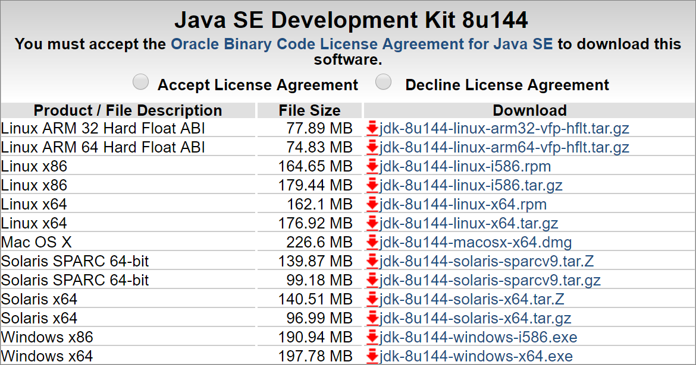

Отбелязваме полето, с което се съгласяваме с условията на лицензите (Accept License Agreement) и избираме инсталационния файл според операционната ни система. Например Windows 64-bit: 

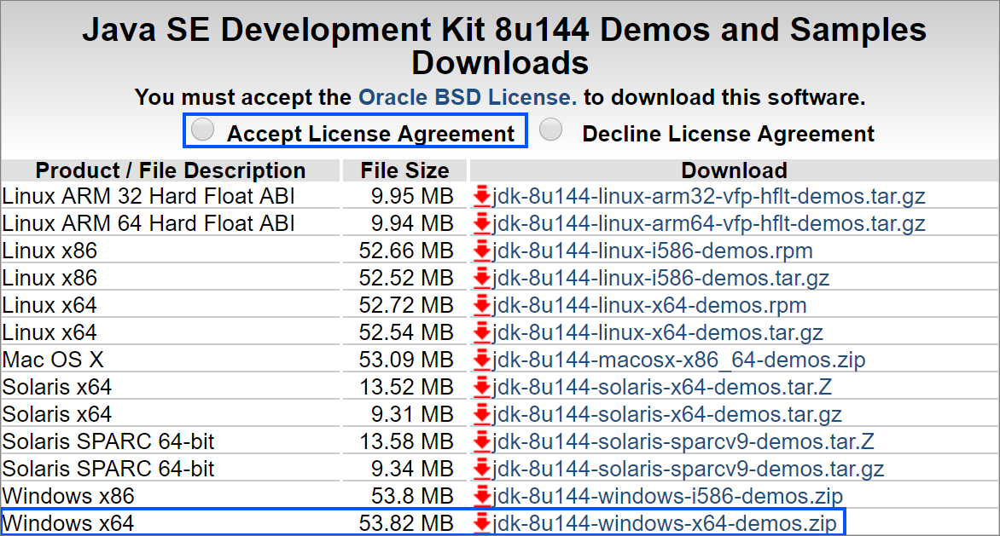

Изтегляме инсталационния файл и го отваряме. Виждаме прозореца за инсталация:

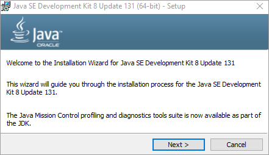

Натискаме бутона [**Next**], докато не започне инсталацията на Java пакета за разработка:

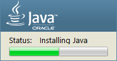

Изчакваме, докато инсталацията не приключи и затваряме инсталатора от бутона [**Close**].

## Среда за разработка (IDE)

Както вече стана дума, за да програмираме ни е нужна **среда за разработка** - **Integrated Development Environment** (IDE). Това е всъщност редактор за програми, в който пишем програмния код и можем да го компилираме и изпълняваме, да виждаме грешките, да ги поправяме и да стартираме програмата отново.
 - За програмиране на Java, подходящи са средите **IntelliJ IDEA**, **Eclipse** или **NetBeans**.
 - Ако програмираме на C#, можем да ползваме средата **Visual Studio** за операционната система Windows и **MonoDevelop** или **Raider** за Linux или Mac OS X.
 - Ако ще пишем на Python, можем да използваме средата **PyCharm**.

## Инсталация на IntelliJ IDEA

Започваме с инсталацията на интегрираната среда **IntelliJ IDEA Community** (версия 2017, актуална към юли 2017 г.).

**Community** версията на IntelliJ IDEA се разпространява безплатно от JetBrains и може да бъде изтеглена от: [https://www.jetbrains.com/idea/download](https://www.jetbrains.com/idea/download). 

В следващите редове подробно са описани **стъпките за инсталация на IntelliJ IDEA** (версия Community 2017). След като свалим инсталационния файл и го стартираме, се появява следният екран:

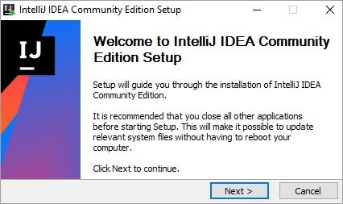

Натискаме бутона [**Next**], след което ще видим прозореца долу:

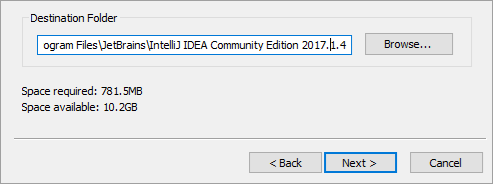

Отново избираме [**Next**] и се зарежда прозорец с инсталационния панел на IntelliJ IDEA.

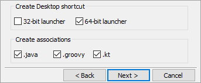

Избираме 32-bit launcher или 64-bit launcher в зависимост от това колко битова е операционната система, която ползваме. Слагаме отметка на [**.java**], [**.groovy**] и [**.kt**], след което натискаме бутона [**Next**]. 


Запазваме името на папката в старт менюто и натискаме бутона [**Install**]. Започва инсталацията на IntelliJ IDEA и ще се появи екран като този по-долу:

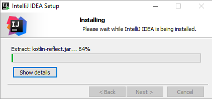

След като IntelliJ IDEA се инсталира, ще се появи информативен екран, в който избираме отметката [**Run IntelliJ IDEA**] и натискаме бутона [**Finish**], за да приключим инсталацията и да стартираме средата за разработка:

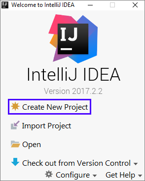

От началния прозорец на IntelliJ IDEA, избираме [**Create New Project**]:

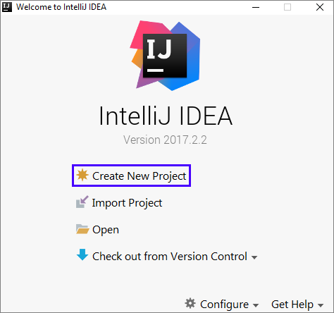

Визуализира се прозорец, в който се вижда, че липсва избран пакет за разработка на софтуер - Software Development Kit (SDK): 

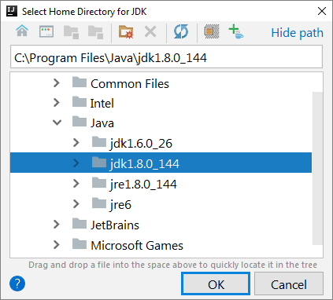

Натискаме [**New**] и намираме пътя към вече инсталирания Java пакет за разработка (JDK), като внимаваме да не изберем JRE:

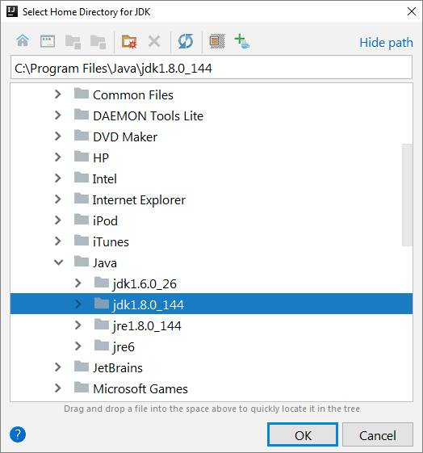

Селектираме папката и натискаме бутона [**OK**]. 

Това е всичко. Готови сме за работа с IntelliJ IDEA.

### По-стари версии на IntelliJ IDEA

Можем да използваме и по-стари версии на IntelliJ IDEA, но **не е препоръчително**, тъй като в тях може да не се съдържат някои от по-новите възможности за разработка и не всички примери от книгата ще тръгнат.

### Онлайн среди за разработка

Съществуват и **алтернативни среди за разработка онлайн**, директно във вашия уеб браузър. Тези среди не са много удобни, но ако нямате друга възможност, може да стартирате обучението си с тях и да си качите IntelliJ IDEA по-късно. Ето някои линкове:
* За Java можем да използваме следното онлайн Java IDE: [https://www.compilejava.net](https://www.compilejava.net).
* За езика C# сайтът **.NET Fiddle** позволява писане на код и изпълнението му онлайн: [https://dotnetfiddle.net](https://dotnetfiddle.net).
* За JavaScript можем да пишем JS код директно в конзолата на даден браузър с натискане на **[F12]**.

### Проектни решения и проекти в IntelliJ IDEA

Проектът в IntelliJ IDEA **логически групира множество файлове**, изграждащи дадено приложение или компонент. Един **IntelliJ IDEA проект** съдържа един или повече **Java сорс файла**, конфигурационни файлове и други ресурси. Във всеки Java сорс файл има една или повече **дефиниции на типове** (класове или други дефиниции). В **класовете** има **методи** (действия), а те се състоят от **поредици от команди**. Изглежда сложно, но при големи проекти такава структура е много удобна и позволява добра организация на работните файлове.

### Пример: създаване на конзолна програма "Hello Java"

Да се върнем на нашата конзолна програма. Вече имаме IntelliJ IDEA и можем да го стартираме. След това създаваме нов конзолен проект от [**Create New Project**]. Избирaме от диалоговия прозорец [Java] -> [Comand Line App] и даваме подходящо име на проекта, например `HelloJava`:

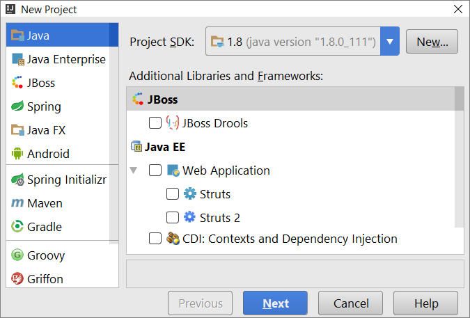

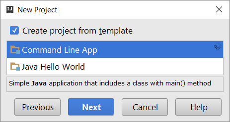

IntelliJ IDEA ще създаде за нас **празна Java програма**, която трябва да допишем.

#### Писане на програмен код

Сорс кодът на Java програмите се пише в секцията **`main(String[] args)`**, между отварящата и затварящата скоба **`{ }`**. Това е главният метод (действие), което се изпълнява при стартиране на една Java програма. Натискаме [**Enter**] след **отварящата скоба** **`{`** и **започваме да пишем**. Кодът на програмата се пише **отместен навътре**, като това е част от оформянето на текста, за по-голямо удобство при повторен преглед и/или дебъгване.

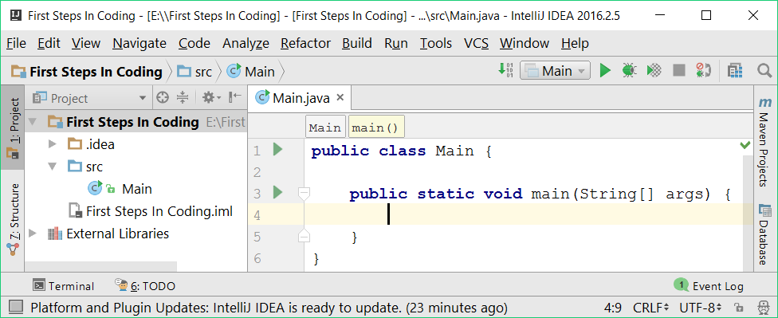

Пишем следната команда:

```java
System.out.println("Hello Java");
```

Ето как трябва да изглежда нашата програма в IntelliJ IDEA:

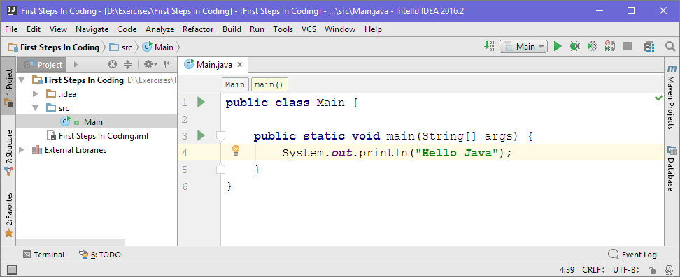

Командата **`System.out.println("Hello Java")`** на езика Java означава да изпълним отпечатване върху конзолата (**`out.println(...)`**) и да отпечатаме текстово съобщение **`Hello Java`**. Kавичките служат за пояснение, че това е текст. В края на всяка команда на езика Java се слага символът **`;`** , който указва, че командата свършва на това място (т.е. не продължава на следващия ред).

Тази команда e типична за програмирането: указваме да се намери даден **обект** (в случая PrintStream обект с име `out`, който се намира в обекта System) и върху него да се изпълни някакво **действие** (в случая печатане на нещо, което се задава в скоби). По-техническо обяснено, извикваме метода **`println(...)`** от класа **`PrintStream`**, който е част от класа System и му подаваме като параметър текстов литерал **`"Hello Java"`**.

#### Стартиране на програмата

За стартиране на програмата натискаме [**Ctrl+Shift+F10**]. Ако няма грешки, програмата ще се изпълни. Резултатът ще се изпише на конзолата (прозорецът, който се намира най-отдолу в IntelliJ IDEA):

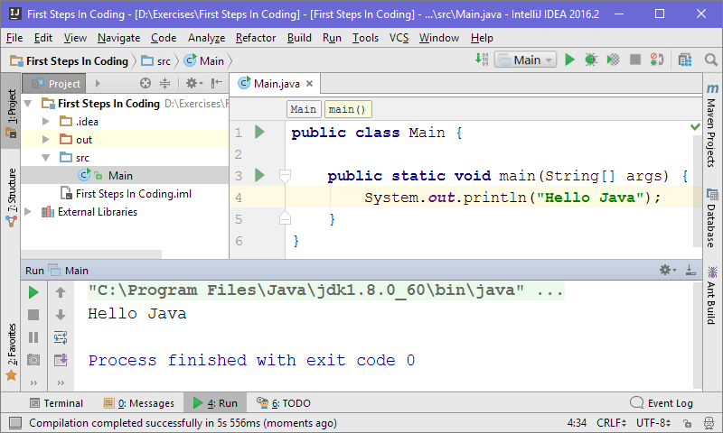

Всъщност, изходът от програмата е следното текстово съобщение:

```java
Hello Java
```

Съобщението "**`Process finished with exit code 0`**" се изписва допълнително на най-долния ред на конзолата от IntelliJ IDEA и ни показва, че програмата е завършила успешно без грешки.

#### Тестване на програмата в Judge системата

Тестването на задачите от тази книга е автоматизирано и се осъществява през Интернет, от сайта на **Judge системата**: [https://judge.softuni.bg](https://judge.softuni.bg). Оценяването на задачите се извършва на момента от системата. Всяка задача минава поредица от тестове, като всеки успешно преминат тест дава предвидените за него точки. Тестовете, които се подават на задачите, са скрити.

Горната програма може да тестваме тук: [https://judge.softuni.bg/Contests/Practice/Index/646#0](https://judge.softuni.bg/Contests/Practice/Index/646#0). Поставяме целия сорс код на програмата в черното поле, като внимаваме дали сме избирали **Java code** от падащото меню:


Изпращаме решението за оценяване с бутона [**Изпрати**]. Системата връща резултат след няколко секунди в таблицата с изпратени решения. При необходимост може да натиснем бутона за обновяване на резултатите **[refresh]** в горната дясна част на таблицата с изпратени за проверка решения:

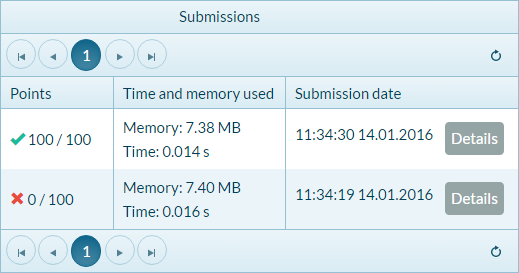

В таблицата с изпратените решения judge системата ще покаже един от следните **възможни резултати**:
* **Брой точки** (между 0 и 100), когато предаденият код се компилира успешно (няма синтактични грешки) и може да бъде тестван.
  - При **вярно решение** всички тестове са маркирани в зелено и получаваме **100 точки**.
  - При **грешно решение** някои от тестовете са маркирани в червено и получаваме непълен брой точки или 0 точки.
* При грешна програма ще получим **съобщение за грешка** по време на компилация.

#### Как да се регистрирам в SoftUni Judge?

Използваме идентификацията си (username + password) за сайта softuni.bg. Ако нямате СофтУни регистрация, направете си. Отнема само минутка - стандартна регистрация в Интернет сайт.

## Типични грешки в Java програмите

Една от често срещаните грешки при начинаещите е **писането извън тялото на ``main(String[] args)`` метода**, защото интегрираната среда или компилаторът не биха могли правилно да разчетат зададените команди в програмата. Ето пример за грешно написана програма:

```java
static void main(String[] args)
{
}
System.out.println("Hello SoftUni");
```

Друга грешка е бъркането на **главни и малки букви**, а те имат значение при извикване на командите и тяхното правилно функциониране. Ето пример за такава грешка:

```java
static void main(String[] args)
{
    System.out.Println("Hello SoftUni");
}
```

В горния пример **`Println`** е изписано грешно и трябва да се поправи на **`println`**.

Липсата на **точка и запетая** (**`;`**) в края на командите е един от вечните проблеми на начинаещия програмист. Пропускането на този знак води до **неправилно функциониране на програмата** и **често проблемът остава незабелязан**. Ето примерен грешен код:

```java
static void main(String[] args)
{
    System.out.Println("Hello SoftUni")
}
```

Липсваща **кавичка** или **липса на отваряща или затваряща скоба** също може да се окажат проблеми. Kакто и при точката и запетаята, така и тук проблемът води до **неправилно функциониране на програмата** или въобще до нейното неизпълнение. Този пропуск трудно се забелязва при по-обемен код. Ето пример за грешна програма:

```java
static void main(String[] args)
{
    System.out.println("Hello SoftUni);
}
```

Тази програма ще даде **грешка при опит за компилация** и стартиране и даже още преди това кодът ще бъде подчертан, за да се насочи вниманието на програмиста към грешката, която е допуснал (пропуснатата затваряща кавичка).


## Какво научихме от тази глава?

На първо място научихме **какво е програмирането** - **задаване на команди, изписани на компютърен език**, които машината разбира и може да изпълни. Разбрахме още какво е **компютърната програма** - тя представлява **поредица от команди**, подредени една след друга. Запознахме се с **езика за програмиране Java** на базисно ниво и как **да създаваме прости конзолни програми** с IntelliJ IDEA. Проследихме и **структурата на програмния код в езика Java**, като например, че командите главно се задават в секцията **``static void main(String[] args)``** между **отварящата и затварящата къдрава скоба**. Видяхме как да печатаме с **`System.out.println(...)`** и как да стартираме програмата си с [**Ctrl+Shift+F10**]. Научихме се да тестваме кода си в **SoftUni Judge**.

Добра работа! Да се захващаме с **упражненията**. Нали не сте забравили, че програмиране се учи с много писане на код и решаване на задачи? Да решим няколко задачи, за да затвърдим наученото.


## Упражнения: първи стъпки в коденето

Добре дошли в упражненията. Сега ще напишем няколко конзолни програми, с които ще направим още няколко първи стъпки в програмирането, след което ще покажем как можем да програмираме нещо по-сложно - програми с графичен и уеб потребителски интерфейс.

### Задача: конзолна програма “Expression”

Да се напише конзолна Java програма, която **пресмята** и **отпечатва** стойността на следния числен израз:

<p align="center"> (3522 + 52353) * 23 - (2336 * 501 + 23432 - 6743) * 3 </p>

Забележка: **не е разрешено да се пресметне стойността предварително** (например с Windows Calculator).

#### Насоки и подсказки

Правим **нов Java конзолен проект** с име "**Expression**".	Намираме метода **``static void main(String[] args)``** и **влизаме в неговото тяло** между **`{`** и **`}`**. След това трябва да **напишем кода**, който да изчисли горния числен израз и да отпечата на конзолата стойността му. Подаваме горния числен израз в скобите на командата **``System.out.println()(...)``**:

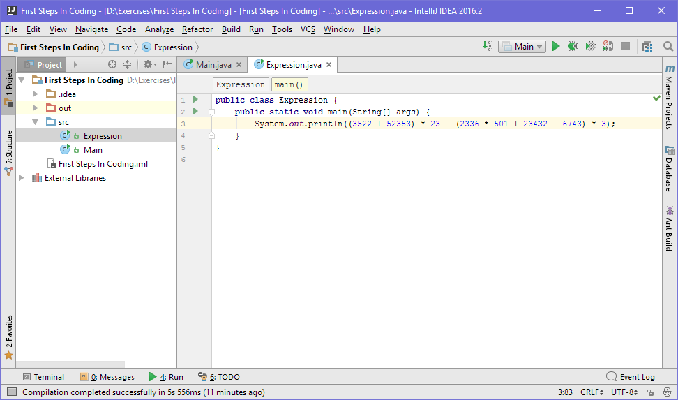

Стартираме програмата с [**Ctrl+Shift+F10**] и проверяваме дали резултатът е същия като на картинката:

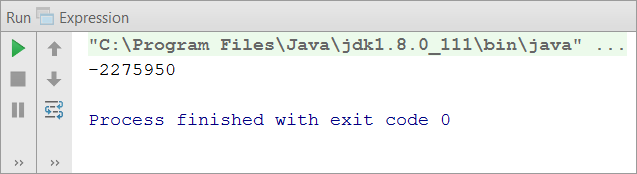

#### Тестване в Judge системата

Тествайте решението си тук: [https://judge.softuni.bg/Contests/Practice/Index/646#1](https://judge.softuni.bg/Contests/Practice/Index/646#1)

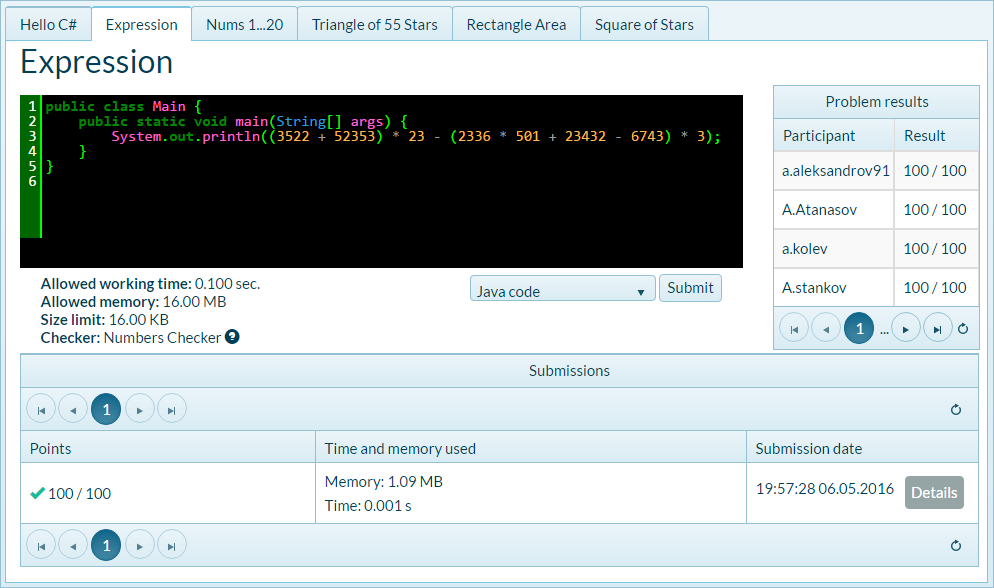


### Задача: числата от 1 до 20

Да се напише Java конзолна програма, която **отпечатва числата от 1 до 20** на отделни редове на конзолата.

#### Насоки и подсказки

Създаваме нов Java клас с име "**Nums1To20**" (десен бутон върху "**src**" папката -> New -> Java Class):


В **`static void main(String[] args)`** метода пишем 20 команди **``System.out.println(...)``**, всяка на отделен ред, за да отпечатаме числата от 1 до 20 едно след друго. По-досетливите от вас, сигурно се питат дали няма по-умен начин. Спокойно, има, но за него по-късно.

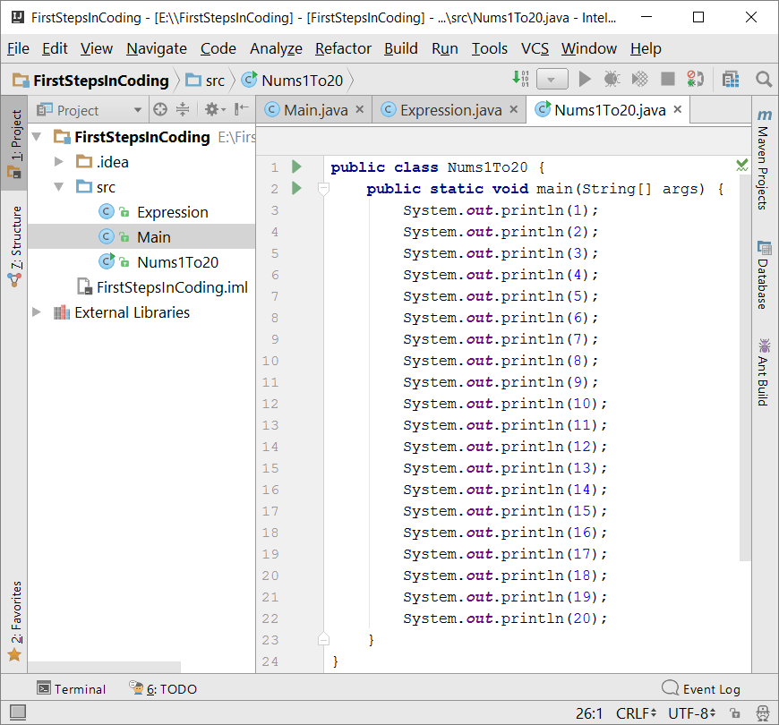

Сега **стартираме програмата** и проверяваме дали резултатът е какъвто се очаква да бъде:
```
1
2
...
20
```

#### Тестване в Judge системата

Тествайте решението си тук: [https://judge.softuni.bg/Contests/Practice/Index/646#2](https://judge.softuni.bg/Contests/Practice/Index/646#2)

Сега помислете дали може да напишем програмата по **по-умен начин**, така че да не повтаряме 20 пъти една и съща команда. Потърсете в Интернет информация за "**[for loop Java](https://www.google.bg/search?q=for+loop+Java&oq=for+loop+Java)**".


### Задача: Триъгълник от 55 звездички

Да се напише Java конзолна програма, която **отпечатва триъгълник от 55 звездички**, разположени на 10 реда:

```
*
**
***
****
*****
******
*******
********
*********
**********
```

#### Насоки и подсказки

Създаваме **ново конзолно Java приложение** с име “**TriangleOf55Stars**”. В него трябва да напишем код, който печата триъгълника от звездички, например чрез 10 команди, като посочените по-долу:
```java
System.out.println("*");
System.out.println("**");
...
```

#### Тестване в Judge системата

Тествайте решението си тук: [https://judge.softuni.bg/Contests/Practice/Index/646#3](https://judge.softuni.bg/Contests/Practice/Index/646#3)

Опитайте да **подобрите решението**, така че да няма много повтарящи се команди. Може ли това да стане с **`for`** цикъл? Успяхте ли да намерите умно решение (например с цикъл) на предната задача? При тази задача може да се ползва нещо подобно, но малко по-сложно (два цикъла един в друг). Ако не успеете, няма проблем, ще учим цикли след няколко глави и ще си спомните за тази задача тогава.


### Задача: лице на правоъгълник

Да се напише Java програма, която **прочита** от конзолата **две числа a и b**, **пресмята** и **отпечатва** лицето на правоъгълник със страни **a** и **b**. 

#### Примерен вход и изход

| a | b | area |
| :---: | :---: | :---: |
| 2 | 7 |  14  |
| 7 | 8 |  56  |
| 12 | 5 |  60  |

#### Насоки и подсказки

Правим нова **конзолна Java програма**. За да **прочетем двете числа**, използваме следните две команди:

```java
static void main(String[] args)
{
    Scanner console = new Scanner(System.in);
    int a = Integer.parseInt(console.nextLine());
    int b = Integer.parseInt(console.nextLine());
            
    // TODO: calculate the area and print it
}
```

Остава да се допише програмата по-горе, за да пресмята лицето на правоъгълника и да го отпечата. Използвайте познатата ни вече команда **`System.out.println()`** и й подайте в скобите произведението на числата **a** и **b**. В програмирането умножението се извършва с оператора **`*`**.

#### Тествайте решението си

Тествайте решението си с няколко примера. Трябва да получите рзултат, подобен на този (въвеждаме 2 и 7 като вход и програмата отпечатва като резултат 14 - тяхното произведение):
```
2
7
14
```

#### Тестване в Judge системата

Тествайте решението си тук: [https://judge.softuni.bg/Contests/Practice/Index/646#4](https://judge.softuni.bg/Contests/Practice/Index/646#4)


### \* Задача: квадрат от звездички

Да се напише Java конзолна програма, която **прочита** от конзолата **цяло положително число N** и **отпечатва** на конзолата **квадрат от N звездички**, като в примерите по-долу.

#### Примерен вход и изход

| Вход  |    Изход   	| Вход  |    Изход   	| Вход  |    Изход   	| 
|-----|-----------|-----|-----------|-----|----------|
|  3  	|<code>\*\*\*</code><br><code>\*&nbsp;\*</code><br><code>\*\*\*</code>|  4  |<code>\*\*\*\*</code><br><code>\*&nbsp;&nbsp;\*</code><br><code>\*&nbsp;&nbsp;\*</code><br><code>\*\*\*\*</code>| 5  	|<code>\*\*\*\*\*</code><br><code>\*&nbsp;&nbsp;&nbsp;\*</code><br><code>\*&nbsp;&nbsp;&nbsp;\*</code><br><code>\*&nbsp;&nbsp;&nbsp;\*</code><br><code>\*\*\*\*\*</code>|

#### Насоки и подсказки

Правим нова **конзолна Java програма**. За да прочетем числото N (2 ≤ N ≤100), използваме следния код:

```java
static void main(String[] args) {
    Scanner console = new Scanner(System.in);
    int n = Integer.parseInt(console.nextLine());
            
    // TODO: print the rectangle
}
```

Да се допише програмата по-горе, за да отпечатва квадрат, съставен от звездички. Може да се наложи да се използват **`for`** цикли. Потърсете информация в Интернет.

**Внимание**: тази задача е по-трудна от останалите и нарочно е дадена сега и е обозначена със звездичка, за да ви провокира да потърсите информация в Интернет. Това е едно от най-важните умения, което трябва да развивате докато учите програмирането: **да търсите информация в Интернет**. Това ще правите всеки ден, ако работите като програмисти, така че не се плашете, а се опитайте. Ако имате трудности, можете да потърсите помощ и в СофтУни форума: https://softuni.bg/forum.

#### Тестване в Judge системата

Тествайте решението си тук: [https://judge.softuni.bg/Contests/Practice/Index/646#5](https://judge.softuni.bg/Contests/Practice/Index/646#5)


## Конзолни, графични и уеб приложения

При **конзолните приложения** (Console Applications), както и сами можете да се досетите, **всички операции** за четене на вход и печатане на изход се **извършват през конзолата**. Там се **въвеждат входните данни**, които се прочитат от приложението, там се **отпечатват и изходните данни** след или по време на изпълнение на програмата.

Докато конзолните приложения **ползват текстовата конзола**, уеб приложенията (Web Аpplications) **използват уеб-базиран потребителски интерфейс**. За да се **постигне тяхното изпълнение** са необходими две неща - **уеб сървър** и **уеб браузър**, като **браузърът** играе главната роля по **визуализация на данните и взаимодействието с потребителя**. Уеб приложенията са много по-приятни за потребителя, изглеждат визуално много по-добре, използват се мишка и докосване с пръст (при таблети и телефони), но зад всичко това стои програмирането. И затова **трябва да се научим да програмираме** и вече направихме първите си съвсем малки стъпки.

Графичните (GUI) приложения имат **визуален потребителски интерфейс**, директно върху вашия компютър или мобилно устройство, без да е необходим уеб браузър. Графичните приложения (настолни приложения или, иначе казано, desktop apps) **се състоят от един или повече графични прозореца**, в които се намират определени **контроли** (текстови полета, бутони, картинки, таблици и други), **служещи за диалог** с потребителя по по-интуитивен начин. Подобни са и мобилните приложения във вашия телефон и таблет: ползваме форми, текстови полета, бутони и други контроли и ги управляваме чрез програмен код. Нали затова се учим сега да пишем код: **кодът е навсякъде в разработката на софтуер**.


## Упражнения: графични и уеб приложения

Сега предстои да направим едно просто **уеб приложение** и едно просто **графично приложение**, за да можем да надникнем в това, какво ще можем да създаваме като напреднем с програмирането и разработката на софтуер. Няма да разглеждаме детайлите по използваните техники и конструкции из основи, а само ще хвърлим поглед върху подредбата и функционалността на създаденото от нас. След като напреднем със знанията си, ще бъдем способни да правим големи и сложни софтуерни приложения и системи. Надяваме се примерите по-долу **да ви запалят интереса**, а не да ви откажат.


### Задача: графично приложение „Суматор за числа“

Да се напише **графично (GUI) приложение**, което **изчислява сумата на две числа**:

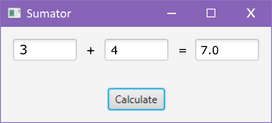

При въвеждане на две числа в първите две текстови полета и натискане на бутона [Calculate] се изчислява тяхната сума и резултатът се показва в третото текстово поле.

За разлика от конзолните приложения, които четат и пишат данните си във вид на текст на конзолата, **графичните (GUI) приложения** имат визуален потребителски интерфейс. Графичните приложения (настолни приложения, desktop apps) се състоят от един от няколко графични прозореца, в които има контроли: текстови полета, бутони, картинки, таблици и други.

За нашето приложение ще използваме технологията **JavaFX**, която позволява създаване на графични приложения за всички платформи с езика за програмиране **Java**. За среда на разработка ще ползваме програмата **IntelliJ IDEA**.

За да направим по-лесно създаването на графични приложения, ще ползваме програмата SceneBuilder, която ще изтеглим от тук https://gluonhq.com/products/scene-builder/#download :

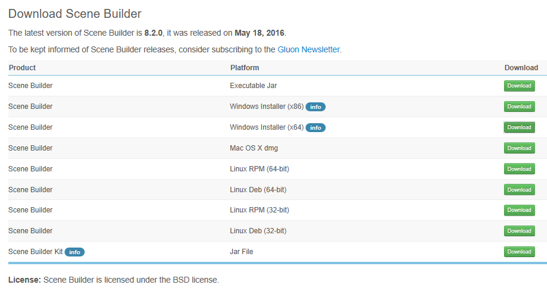

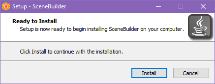

В IntelliJ IDEA създайте нов Java проект от тип **JavaFX Application**:

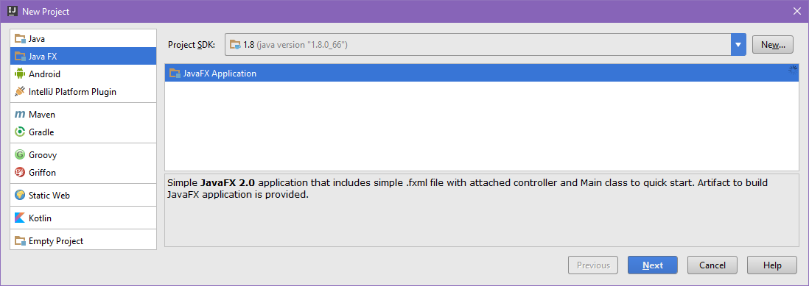

При създаването на JavaFX приложение ще се появи прозорец, който изглежда така:

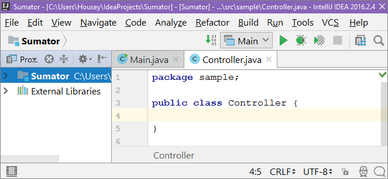

Файлът, в който се намира изгледа на нашето приложение се намира в пътя src/sample/sample.fxml. 
Нека да отидем там и да го отворим:

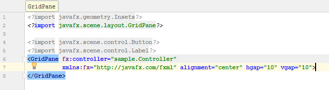

Файлът изглежда по този начин. Няма да работим директно с него, а ще ползваме горепосочения **`SceneBuilder`**, който ще генерира кода вместо нас. Кликваме с десен бутон на файла и избираме **Open in SceneBuilder**:

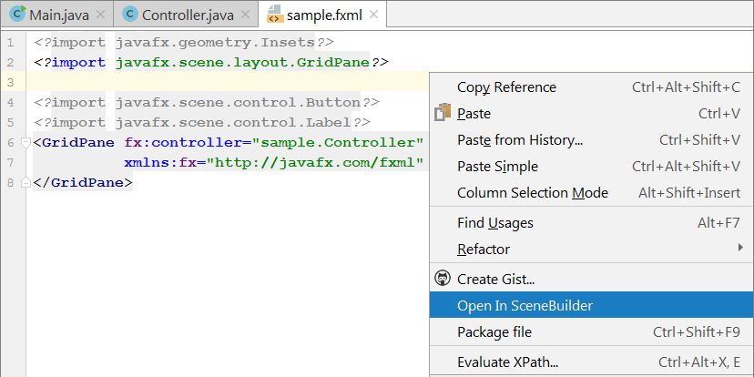

При избирането на тази опция **за първи път**, IntelliJ IDEA ще поиска да посочим пътя към **`SceneBuilder.exe`**:

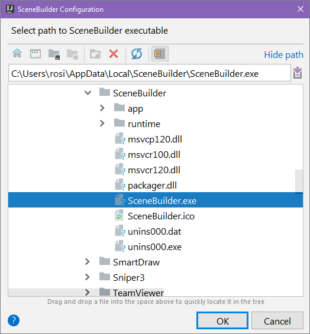

При обикновена инсталация на Windows **`SceneBuilder`** се намира в **C:\Users\[username]\AppData\Local\SceneBuilder**. 

След като сме посочили правилния път, се отваря **`SceneBuilder`** и виждаме този екран: 

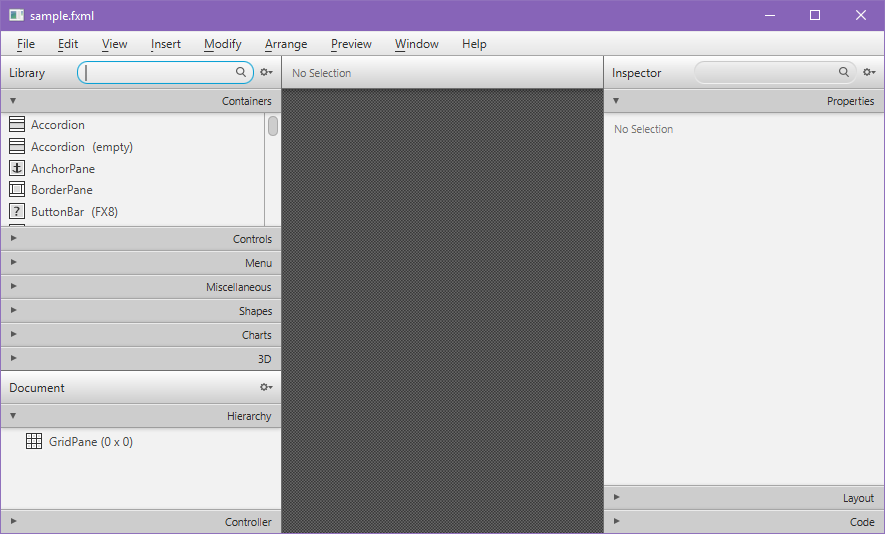

Отляво имаме видовете контроли, които можем да добавяме, така че ще намерим **AnchorPane** прозореца и ще го добавим като го завлечем в средата, където се намира нашият дизайн:

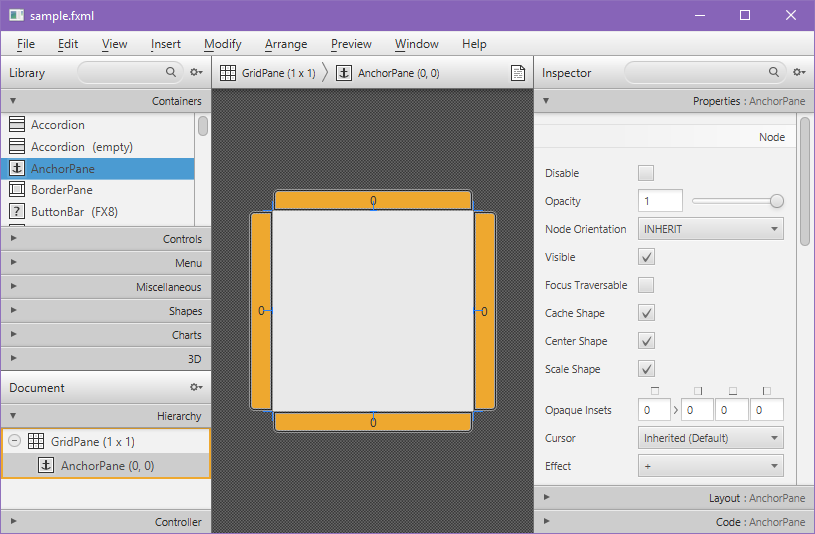

Това е нашият прозорец, в който вече можем да започнем да добавяме контроли, които взимаме от същото място, от което добавихме **AnchorPane (в менюто Containers)**. За нашият интерфейс ни трябват:

  - 3x текстови полета: **TextField**,
  - 2x етикета между текстовите полета (за + и =): **Label**
  - 1x бутон за пресмятане на резултата: **Button**
  
След като ги добавим, нашето приложение трябва да изглежда така:


Ще преименуваме контролите, като изберем по-подходящи имена, отговарящи на функционалността на приложението ни ("**+**" и "**=**"). Това се осъществява като кликнем на контрола, който искаме да променим и отидем в дясно на неговите свойства (Properties).

За начало ще променим свойството **Text** на етикетите. Името им по подразбиране е **Label**:

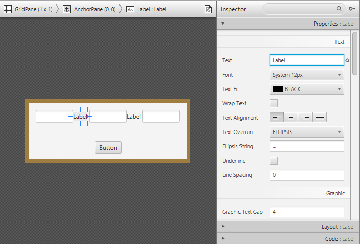

За да отговаря по-добре на логиката на програмата ни, избираме по-смислени имена. Заменяме първия текст "`Label`" с "`+`":

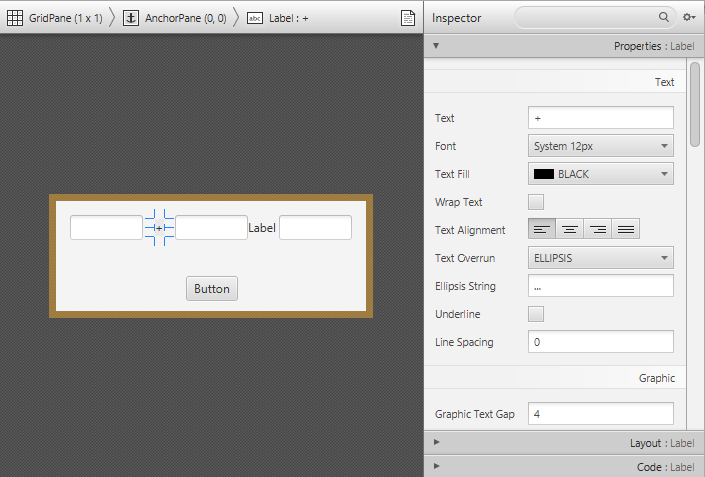

Съответно променяме текста на втория етикет на "`=`", а надписа на бутона на "`Calculate`":

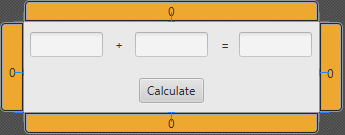

Запазваме промените към дизайна с **Ctrl+S**:


Връщаме се обратно в IntelliJ IDEA и стартираме приложението с **[Shift+F10]**:

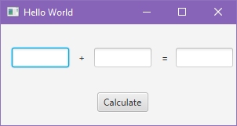

Вероятно приложението изглежда по-голямо или по-малко, отколкото очаквахме. Причината за това е, че в кода на нашето приложение има една част, която казва изрично какви да са неговите размери. Нека оправим този проблем.

Отиваме в класа Main и намираме това парче код:

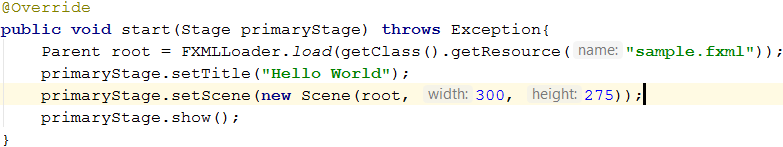

Изтриваме кода, който казва на нашата програма колко ще е голям прозорецът, за да се използва оразмеряването, което ние избрахме в `SceneBuilder`:

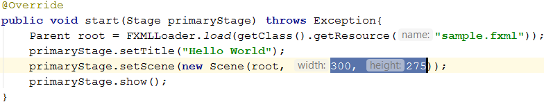

Кодът ни вече изглежда така:

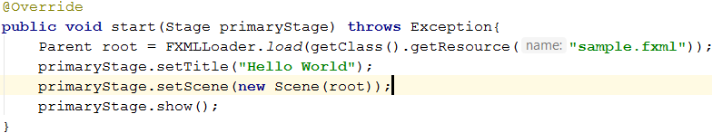

Пускаме програмата пак с **[Shift+F10]** и проверяваме дали оразмеряването е правилно:

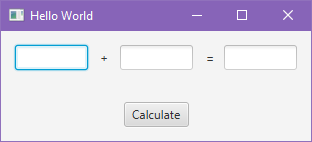

Като последна стъпка за завършването на нашия дизайн, ще се върнем в нашия код и ще променим **заглавието** на приложението, което се намира на този ред:

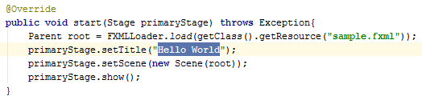

Променяме името от "`Hello World`" на "`Sumator`":


Стартираме приложението:

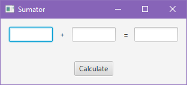

Дизайна изглежда готов. Сега е време за нещо доста по-интересно - **програмната логика**. Време е да напишем кода, който сумира числата от първите две полета и показва резултата в третото поле. За целта трябва да се върнем обратно в **`SceneBuilder`** и да дадем имена на текстовите полета, за да можем да ги достъпваме в кода:

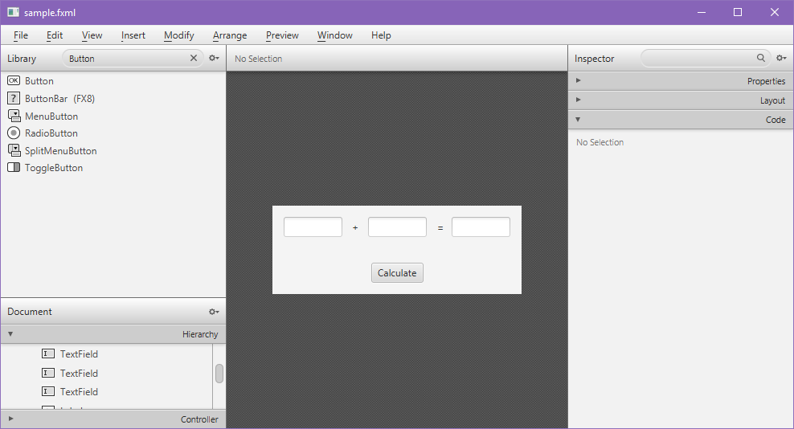

Кликваме първото текстово поле с мишката и отиваме в секцията **Code** отдясно, където ще дадем името **`num1`** в полето **fx:id**:

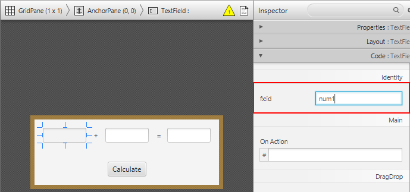

Второто поле преименуваме на **`num2`**:

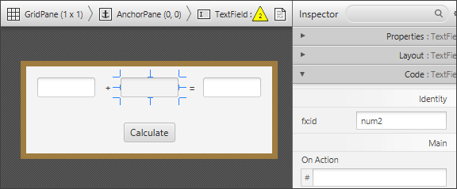

Съответно третото поле наименуваме **`result`**:

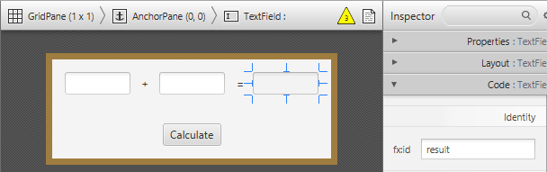

Сега ще кажем на бутона коя функция да изпълнява, когато той бъде кликнат. Отиваме в **On Action** полето и му подаваме името на функцията **`calculate`**, която след малко ще създадем:

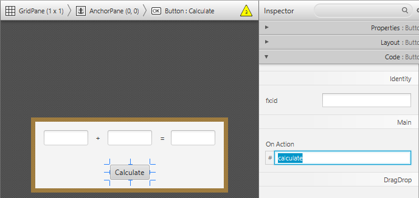

Запазваме промените в SceneBuilder с **[Ctrl+S]** и се връщаме обратно в **`sample.fxml`** файла:

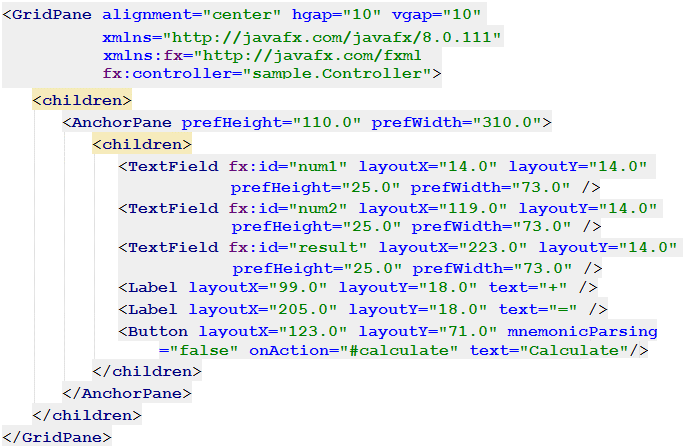

Виждаме, че нашите полета си имат имена, а нашият бутон си има функция, която да се изпълнява, когато той бъде кликнат.
До тук добре, но тези полета и функцията на бутона все още не съществуват в нашия код. За да ги генерираме, ще отидем на всеки от тях и ще натиснем **[Alt+Enter]->Create field [име на полето]**:

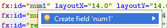

След като създадем едно от полетата, ще бъдем пренасочени към файла **`Controller.java`**, където ще се създаде полето в кода по следния начин:

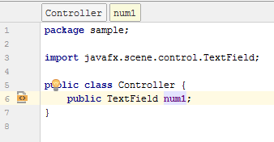

Добавяме по същия начин полетата **`num2`**, **`result`** и функцията **`calculate`**. Кодът в файла **`Controller.java`** би трябвало вече да изглежда по следния начин:

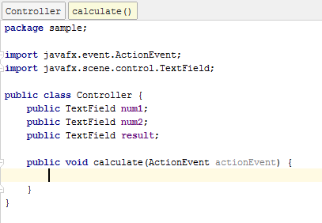

Пишем следния Java код между отварящата и затварящата скоба **`{ }`** на нашата функция **`calculate`**:

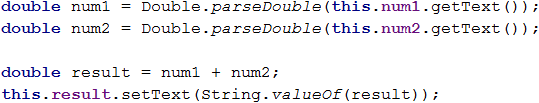

Този код взима първото число от полето **`num1`** в променлива **`num1`**, след това второто число от полето **`num2`** в променлива **`num2`**, след това ги сумира **`num1 + num2`** в променлива **`result`** и накрая извежда текстовата стойност на **`result`** в полето **`result`**.

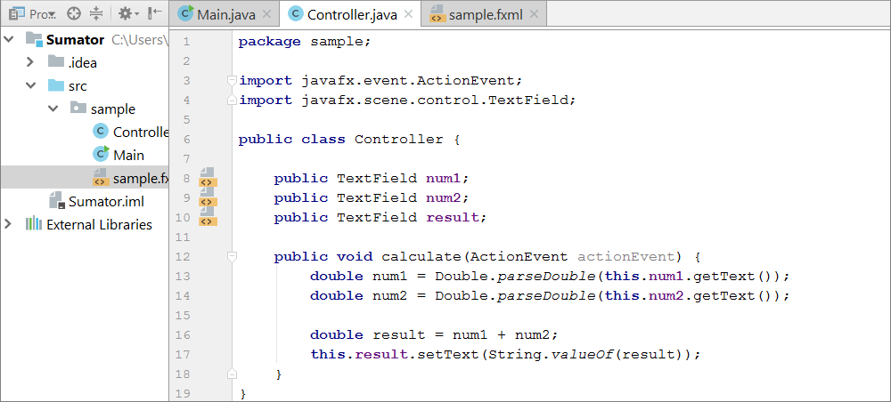

**Стартираме** отново програмата с **[Shift+F10]** и **пробваме дали работи**. Тестваме дали можем да сметнем сбора на различни стойности правилно. Първо въвеждаме две цели числа - например **`4 + 5`**:

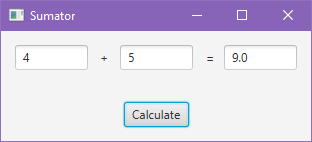

След това пробваме да съберем отрицателно и положително нецяло число - например **`-12.5 + 1.3`**:

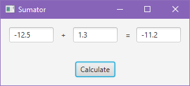

Опитваме да въведем невалиден вход, примерно **`aaa`** и **`bbb`**: 

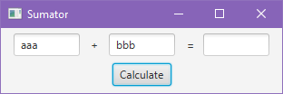

Виждаме, че има проблем:

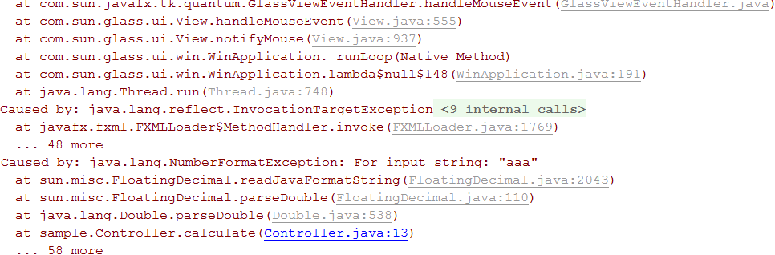

Това се случва заради прехвърлянето на текстово поле в число. Ако стойността в полето не е число, програмата се чупи и **дава грешка**. Можем да поправим кода така:

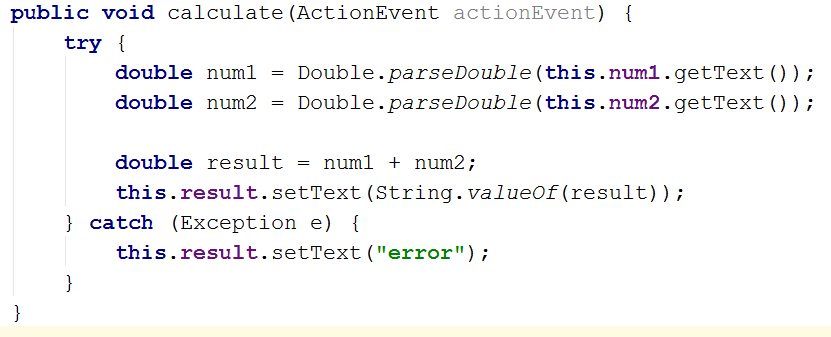

С този код прихващаме грешките при работа с числа (**хващаме изключенията**) и в случай на грешка извеждаме стойност **"error"** в полето с резултата. Стартираме отново програмата с [Shift+F10] и я пробваме дали работи. Този път при грешно число резултатът е **"error"** и програмата не се чупи:

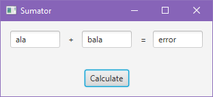

Сложно ли е? Нормално е да е сложно, разбира се. Тъкмо започваме да навлизаме в програмирането. Примерът по-горе изисква още много знания и умения, които ще развиваме в тази книга и даже и след нея. Просто си позволете да се позабавлявате с desktop програмирането. Ако не тръгва нещо, гледайте **видеото в началото на тази глава** или питайте във **форума на СофтУни**: https://softuni.bg/forum. Или продължете смело напред към следващия пример или към следващата глава от книгата. Ще дойде време и ще ви е лесно, но наистина трябва да вложите **усърдие и постоянство**. Програмирането се учи бавно и с много, много практика.

### Уеб приложение: суматор за числа

Сега ще напишем нещо още по-сложно, но и по-интересно: уеб приложение, което **изчислява сумата на две числа**. При **въвеждане на две числа** в първите две текстови полета и натискане на бутона [**Calculate**] се **изчислява тяхната сума** и резултатът се показва в третото текстово поле. Очаква се приложението да изглежда приблизително по следния начин:

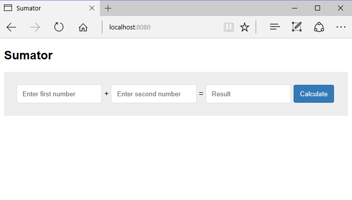

За разлика от конзолните приложения, които четат и пишат данните си във вид на текст на конзолата, **уеб приложенията** имат **уеб базиран потребителски интерфейс**. Уеб приложенията се зареждат от някакъв **Интернет адрес** (URL) чрез стандартен **уеб браузър**. Потребителите пишат входните данни в страница, визуализирана от уеб приложението, данните се обработват на уеб сървъра и резултатите се показват отново в страницата в уеб браузъра.

За нашето уеб приложение ще използваме технологията **Spring MVC**, която позволява създаване на уеб приложения с езика за програмиране **Java** в средата за разработка **IntelliJ IDEA**. 

В IntelliJ IDEA, вкарайте проекта от скелета [https://github.com/SoftUni/Programming-Basics-Book-Java-BG/blob/master/assets/chapter-1-assets/1.%20First-Steps-in-Coding-Exercises-Web-Skeleton.zip](https://github.com/SoftUni/Programming-Basics-Book-Java-BG/blob/master/assets/chapter-1-assets/1.%20First-Steps-in-Coding-Exercises-Web-Skeleton.zip), чрез **Import Project**:


Намираме папката, в която сме свалили скелета:

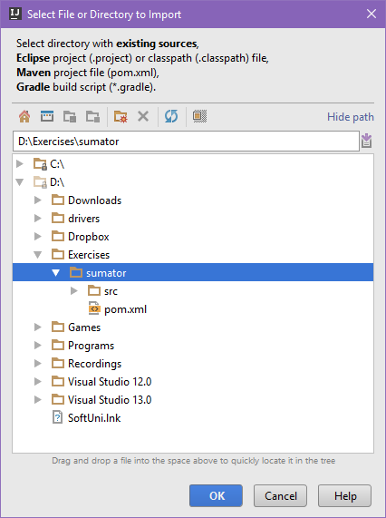

Избираме [**Import project from external model**] и след това [**Maven**]:

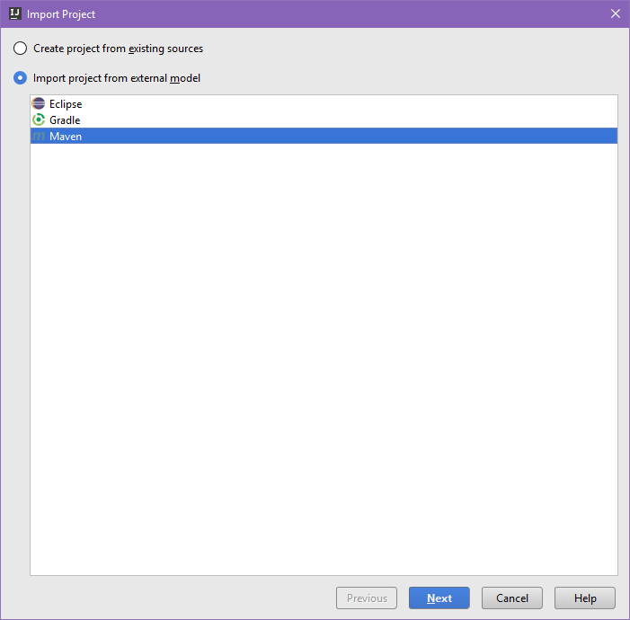


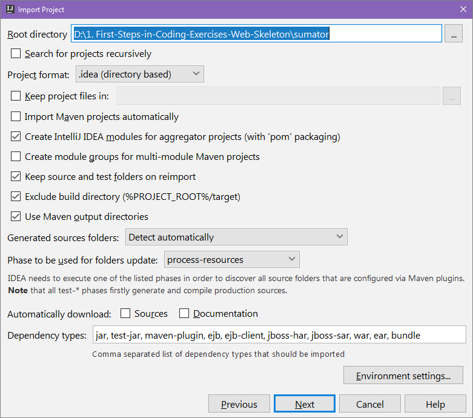


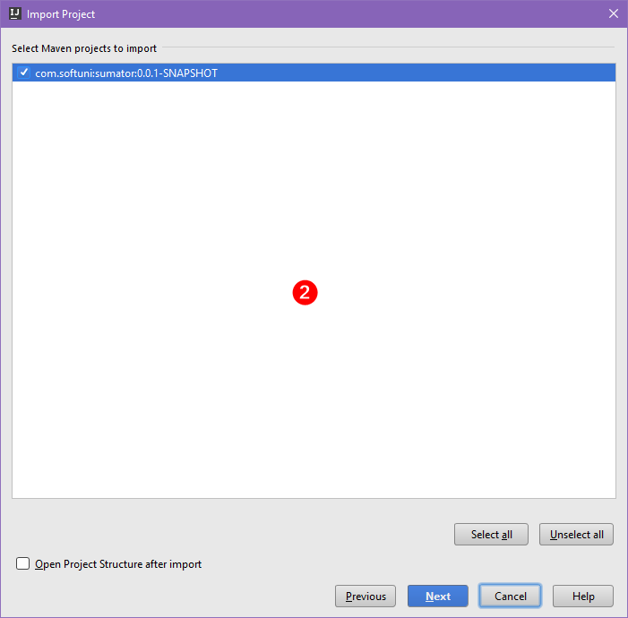


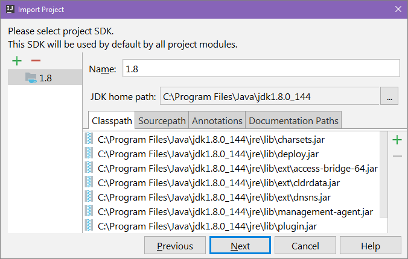


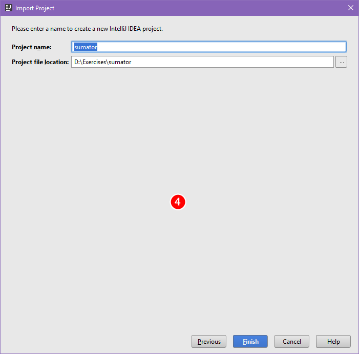

След като вкараме проекта в IntelliJ, той би трябвало да изглежда така:

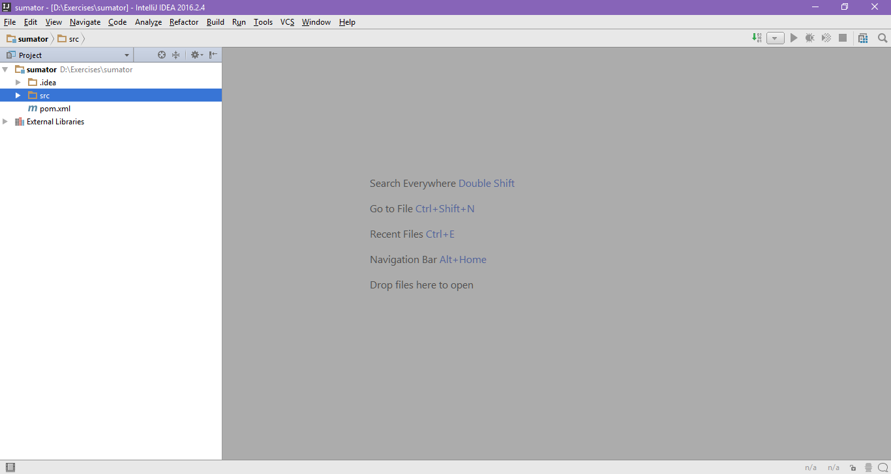

Пускаме проекта, за да видим дали тръгва без грешки. За да осъществим това, ще отидем в папката "src/main/java/com.softuni" и отворим файла **`SumatorApplication`**:

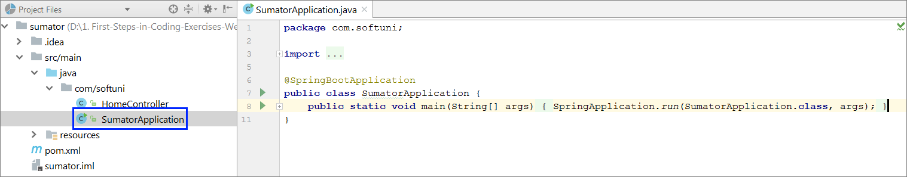

За да пуснем програмата можем да използваме клавишната комбинация [**Ctrl+Shift+F10**], или да изберем [**Run 'SumatorApplication.main()'**] от контекстното меню:

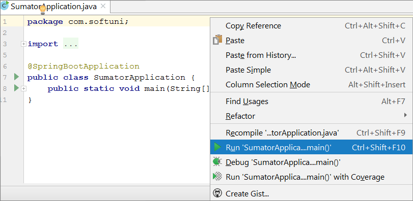

След като уеб приложението зареди, би трябвало да видим това съобщение най-отдолу в конзолата, която се отваря:


Можем да пуснем приложението и да проверим дали работи, като отидем в нашия уеб браузър и напишем **localhost:8080**:

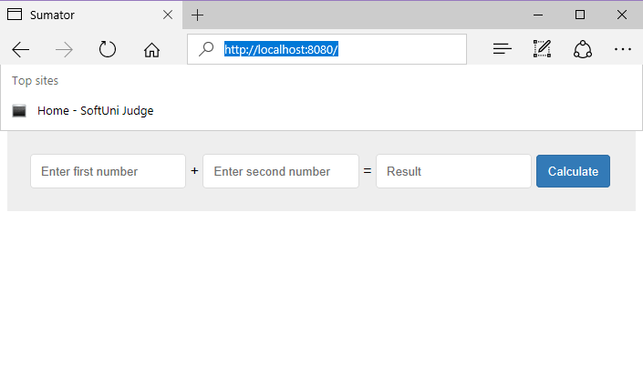

До тук добре, само че когато въведем две числа и натиснем [**Calculate**], не се случва нищо. Нека да напишем логиката, която е нужна, за да работи суматорът коректно.

Отваряме файла **`HomeController`** в същата папка и би трябвало да видим следното:

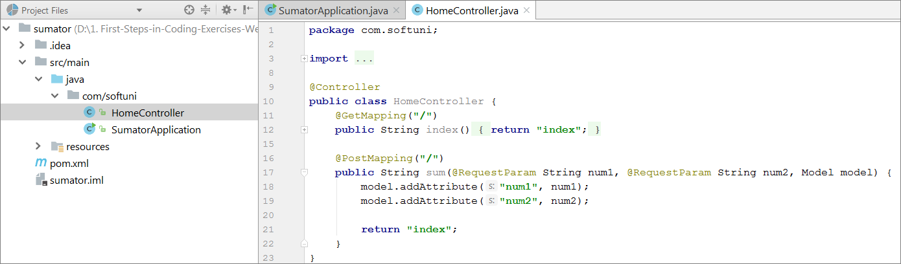

Частта, която ни интересува е функцията **`sum`**:

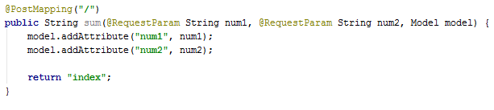

В момента, тази функция приема два текста **`num1`** и **`num2`**, подава ги на сървъра и връща файла **`index`** на потребителя. Както може би се досещате, вътре няма код, който пресмята числата в двете текстови полета и ги подава на третото поле. Нека напишем логиката, която ще осъществи това.

Отиваме между къдравите скоби и написваме следния код:

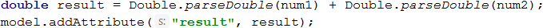

Ето как трябва да изглежда файлът **`HomeController`** след промяната:

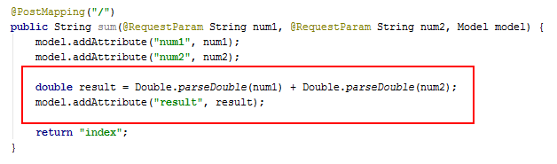

Преди да се върнем обратно в приложението, трябва да приложим нашите промени. Ще направим това като отидем в прозореца на конзолата и натиснем бутона [**Rerun application**]:

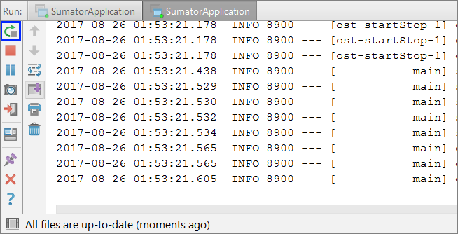

Приложението е готово. Ако въведем две числа в текстовите полета и натиснем бутона [**Calculate**], би трябвало резултата да излезе в третото текстово поле:

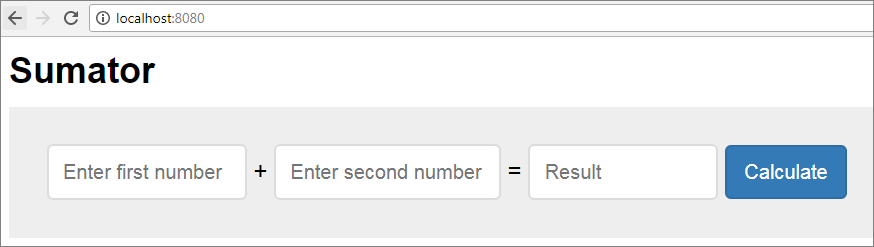


Страшно ли изглежда? **Не се плашете!** Имаме да учим още много, за да достигнем ниво на знания и умения, за да пишем свободно уеб-базирани приложения, като в примера по-горе и много по-големи и по-сложни. Ако не успеете да се справите, няма страшно, продължете спокойно напред. След време ще си спомняте с усмивка колко непонятен и вълнуващ е бил първият ви сблъсък с уеб програмирането. Ако имате проблеми с примера по-горе, **гледайте видеото** в началото на тази глава. Там приложението е направено на живо стъпка по стъпка с много обяснения. Или питайте във **форума на СофтУни**: https://softuni.bg/forum.

Целта на горните два примера (графично desktop приложение и уеб приложение) не е да се научите, а да се докоснете по-надълбоко до програмирането, **да разпалите интереса си** към разработката на софтуер и да се вдъхновите да учите здраво. **Имате да учите още много**, но пък е интересно, нали?

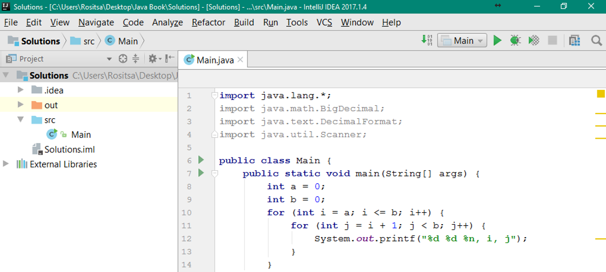

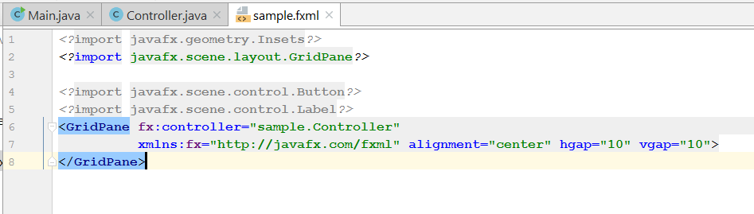
