# Глава 2.1. Прости пресмятания с числа

- Какво представлява **системната конзола**?
В настоящата глава ще се запознаем със следните концепции и програмни техники:
- Как да **прочитаме числа** от системната конзола?
- Как да работим с **типове данни и променливи**, които са ни необходими при обработка на числа и операциите между тях?
- Как да **изведем** резултат (число) на системната конзола?
- Как да извършваме прости **аритметични операции**: събиране, изваждане, умножение, деление, съединяване на низ?

## Видео

<div class="video-player">
  Гледайте видео-урок по тази глава тук: <a target="_blank" href="https://www.youtube.com/watch?v=7u4X5X-a9Qg">https://www.youtube.com/watch?v=7u4X5X-a9Qg</a>.
</div>

## Системна конзола

Обикновено наричана само "**конзола**", системната или още компютърната конзола, представлява устройството, чрез което подаваме команди на компютъра в текстов вид и получаваме резултатите от тяхното изпълнение отново като текст.

В повечето случаи системната конзола представлява текстов терминал, т.е. приема и визуализира само **текст**, без графични елементи като например бутони, менюта и т.н. Обикновено изглежда като прозорец с черен цвят, в който пишем изпълняваме **конзолни команди**, които отпечатват текстов резултат. В **Windows** конзолата изглежда ето така:


В повечето операционни системи, обикновено **конзолата** е достъпна като самостоятелно приложение, на което пишем различни конзолни команди. В Windows се нарича **Command Prompt**, а в Linux и macOS се нарича **Terminal**. В конзолата се изпълняват конзолни приложения. Те четат текстов вход от командния ред и печатат изхода си като текстов изход на конзолата. В настоящата книга ще се учим на програмиране като създаваме предимно **конзолни приложения**.

Ето как изглежда конзолата в **Linux**:


## Четене на числа от конзолата

Реално в **Java** има няколко начина да прочетем някакъв вход от **конзолата**. Единият е чрез използването на вградения клас **`Scanner`**, който ще използваме сега, а другият е с изпозването на **`BufferedReader`**. Вторият е малко по-бърз, но ще започнем да го ползваме едва след като се запознаем и с потоците в **Java**.

За да прочетем **цяло** (не дробно) **число** от конзолата е необходимо първо да импортираме класа **`Scanner`** на първия ред от нашата програма, още преди декларацията на основния клас. Слагаме този ред най-отгоре:

```java
import java.util.Scanner;
```

След това в `main(…)` метода на програмата трябва да създадем нова `Scanner` инстанция, която да закачим за системния вход. След през създадения сканиращ четец `scanner` можем да четем цели и дробни числа, текст и други данни. Например с `.nextInt()` четем следващото подадено като вход цяло число:

```java
Scanner scanner = new Scanner(System.in);
int num = scanner.nextInt();
```

Сега в променливата **`num`** от целочислен тип **`int`** имаме прочетена, подадена като вход от **конзолата**.

Java е **статично типизиран език**, а това означава, че променливите имат тип, който се определя по време на компилацията и не може да се променя в движение (както е при динамичните езици като JavaScript и Python). В горния пример променливата `scanner` е от тип `java.util.Scanner` (сканиращ текстов четец), a променливата `num` е от тип `int` (цяло число).

### Пример: пресмятане на лице на квадрат със страна **а**

За пример да вземем следната програма, която **прочита цяло число** от конзолата, **умножава го** по него самото (вдига го на квадрат) и **отпечатва резултата** от умножението. Така можем да пресметнем лицето на квадрат по дадена дължина на страната, прочетена от конзолата. Следва целия сорс код на програмата. Запишете го във файл с име `SquareArea.java`, иначе ще даде грешка при компилация:

```Java
// Put this code in the file: SquareArea.java

import java.util.Scanner;

public class SquareArea {
    public static void main(String[] args) {
        Scanner scanner = new Scanner(System.in);

        System.out.print("a = ");
        int a = scanner.nextInt();
        int area = a * a;

        System.out.print("Square area = ");
        System.out.println(area);
    }
}
```
Ето как би работила програмата при квадрат с размер на страната 15:


Опитайте да въведете грешно число, например "**hello**". Ще получите съобщение за грешка по време на изпълнение (exception). 


Това е напълно нормално, защото езика **Java** е силно типизиран език. По-късно ще разберем как можем да прихващаме такива грешки и да караме потребителя да въвежда число наново.

#### Как работи примерът?

Първият ред **`Scanner scanner = new Scanner(System.in);`** създава нова инстанция на класа **`Scanner`** със стандартен системен вход.

Следващият ред **`System.out.print("a = ");`** печата информативно съобщение, което подканва потребителя да въведе страната **a** на квадрата. След отпечатването курсорът остава на същия ред. Оставането на същия ред е по-удобно за потребителя чисто визуално. Използва се **`System.out.print(…);`**, а не **`System.out.println(…);`** и така курсорът остава на същия ред.

Следващият ред **`int a = scanner.nextInt();`** прочита цяло число от конзолата. Резултатът се записва в променлива с име **`a`**.

Следващата команда **`int area = a * a;`** записва в нова променлива **`area`** резултата от умножението на **`a`** по **`a`**.

Следващата команда **`System.out.print("Square area = ");`** отпечатва посочения текст без да преминава на нов ред. Отново се използва **`System.out.print(…);`**, а не **`System.out.println("…");`** и така курсорът остава на същия ред, за да може след това да се отпечата и изчисленото лице на квадрата.

Последната команда **`System.out.println(area);`** отпечатва изчислената стойност от променливата **`area`**.

#### Тестване в Judge системата

Тествайте решението си тук: [https://judge.softuni.bg/Contests/Practice/Index/649#0](https://judge.softuni.bg/Contests/Practice/Index/649#0).

#### Четене на дробни числа

Опитайте да преработите горната програма, така че да приема не само цели числа (`int`), но и дробни числа (`double`). Можете да използвате `scanner.nextDouble()`. Повече за дробните числа ще научим след малко.


## Пресмятания в програмирането

За компютрите знаем, че са машини, които обработват данни. Всички **данни** се записват в компютърната памет (RAM памет) в **променливи**. Променливите са именовани области от паметта, които пазят данни от определен тип, например число или текст. Всяка една **променлива** в Java има **име**, **тип** и **стойност**. Ето как бихме дефинирали една променлива, като едновременно с декларацията ѝ, ѝ присвояваме и стойност:


След тяхната обработка, данните се записват отново в променливи (т.е. някъде в паметта, заделена от нашата програма).

## Типове данни и променливи

В програмирането всяка една променлива съхранява определена **стойност** от даден **тип**. Типовете данни могат да бъдат например: **число**, **буква**, **текст** (стринг), **дата**, **цвят**, **картинка**, **списък** и др.
Ето няколко примера за типове данни:
- тип **цяло число**: 1, 2, 3, 4, 5, …
- тип **дробно число**: 0.5, 3.14, -1.5, …
- тип **буква от азбуката** (символ): 'a', 'b', 'c', …
- тип **текст** (стринг): "Здрасти", "Hi", "Beer", …
- тип **ден от седмицата**: Monday, Tuesday, …

## Четене на дробно число от конзолата

За да прочетем **дробно число** от конзолата е необходимо отново да **декларираме променлива**, да посочим **типа на числото**, както и да използваме стандартната команда за четене на информация от системната конзола:

```Java
Scanner scanner = new Scanner(System.in);

Double num = scanner.nextDouble();
```

### Пример: прехвърляне от инчове в сантиметри

Да напишем програма, която чете дробно число в инчове и го обръща в сантиметри:

```Java
Scanner scanner = new Scanner(System.in);

System.out.print("Inches = ");              
Double inches = scanner.nextDouble();
Double centimeters = inches * 2.54;
System.out.print("Centimeters = ");
System.out.println(centimeters);
```

Да стартираме програмата и да се уверим, че при подаване на стойност в инчове, получаваме коректен резултат в сантиметри:

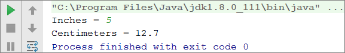

#### Тестване в Judge системата

Тествайте решението си тук: [https://judge.softuni.bg/Contests/Practice/Index/649#1](https://judge.softuni.bg/Contests/Practice/Index/649#1).


## Четене и печатане на текст

За да прочетем текст (стринг) от конзолата, отново **декларираме нова променлива** и използваме стандартната **команда за четене на информация от системната конзола**:

```Java
Scanner scanner = new Scanner(System.in);

String str = scanner.nextLine();
```
Нека обърнем внимание на факта, че при **четене на текст не се налага преобразуването в друг тип**. Това е така, защото по подразбиране методът **`scanner.nextLine(…)`** връща като **резултат текст**. Допълнително, можем да зададем текстa да бъде прехвърлен в цяло число чрез **`Integer.parseInt(…)`** или дробно число чрез **`Double.parseDouble(…)`**. Ако това не се направи, за програмата **всяко едно число** ще бъде просто **текст**, с който **не бихме могли да извършваме** аритметични операции.

### Пример: поздрав по име

Да напишем програма, която въвежда името на потребителя и го поздравява с текста "**Hello, *име***".

```Java 
Scanner scanner = new Scanner(System.in);
         
String name = scanner.nextLine();
System.out.printf("Hello, %s!", name);
```

В този случай, изразът **`%s`** e заместен от **първия** подаден аргумент, който в примера е променливата **`name`**:


#### Тестване в Judge системата

Тествайте решението си тук: [https://judge.softuni.bg/Contests/Practice/Index/649#2](https://judge.softuni.bg/Contests/Practice/Index/649#2).


## Съединяване на текст и числа

При печат в конзолата на текст, числа и други данни, **можем да ги съединим**, като използваме шаблони **`%s`**, **`%d`**, **`%f`** и т.н. В програмирането тези шаблони се наричат **placeholders**, а в зависимост от типа на променливата се използват различни символи за обозначаване на различни типове аргументи. Основните са `%s` за текст (стринг), `%d` за цели числа, `%f` за десетични числа.

Ето един **пример** за печатане на форматиран текст с шаблони (**placeholders**):

```Java
Scanner scanner = new Scanner(System.in);

String firstName = scanner.nextLine();
String lastName = scanner.nextLine();
int age = Integer.parseInt(scanner.nextLine());
String town = scanner.nextLine();
System.out.printf("You are %s %s, a %d-years old person from %s.",
  firstName, lastName, age, town);
```

Ето резултатът, който ще получим след изпълнение на този пример:

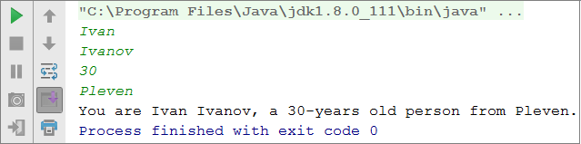

Обърнете внимание как всяка една променлива трябва да бъде подадена в **реда, в който искаме да се печата**, и да съответства на **типа подаден в шаблона**. По същество, шаблонът (**placeholder**) приема променливи от **всякакъв тип**.

### Тестване в Judge системата

Тествайте решението си тук: [https://judge.softuni.bg/Contests/Practice/Index/649#3](https://judge.softuni.bg/Contests/Practice/Index/649#3).


## Аритметични операции

Да разгледаме базовите аритметични операции в програмирането.

### Събиране на числа (оператор **`+`**)

Можем да събираме числа с оператора **`+`**:

```Java
int a = 5;
int b = 7;
int sum = a + b; // резултатът е 12
```

### Изваждане на числа (оператор **`-`**)

Изваждането на числа се извършва с оператора **`-`**:

```Java
Scanner scanner = new Scanner(System.in);

int a = Integer.parseInt(scanner.nextLine());
int b = Integer.parseInt(scanner.nextLine());
int result = a - b;
System.out.println(result);
```

Ето резултатът от изпълнението на програмата (при числа 10 и 3):

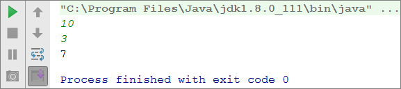

### Умножение на числа (оператор **`*`**)

За умножение на числа използваме оператора **`*`**:

```Java
int a = 5;
int b = 7;
int product = a * b; // 35
```

### Деление на числа (оператор **`/`**)

Делението на числа се извършва с оператора **`/`**. Той работи различно при цели и при дробни числа.
* Когато делим две цели числа, се извършва **целочислено деление** и полученият резултат е цяло число с отрязана дробна част. Например 11 / 3 = 3.
* Когато делим две числа, от които поне едното е дробно, се извършва **дробно деление** и полученият резултат е дробно число, както в математиката. Например 11 / 4.0 = 2.75. При невъзможност за точно разделяне, резултатът се закръгля, например 11.0 / 3 = 3.66666666666667.
* Челочисленото **деление на 0** предизвиква **грешка** по време на изпълнение (`Java.lang.ArithmeticException`).
* Дробното **деление на 0** не предизвиква грешка, а резултатът е **+/- безкрайност** или специалната стойност **`NaN`**. Например 5 / 0.0 = &#8734;.

Ето няколко примера за използване на оператора за делене:

```Java
int a = 25;
int i = a / 4;      // извършваме т.нар. целочислено деление:
                    // резултатът от тази операция ще бъде 6 – дробната част се отрязва, 
                    // тъй като извършваме деление с цели числа
int f = a / 4.0;    // 6.25 – дробно деление. Изрично сме указали числото 4 да се интерпретира
                    // като дробно, като сме добавили десетичната точка, следвана от нула
int error = a / 0;  // Грешка: целочислено деление на 0
```

Да разгледаме и няколко примера за **целочислено деление** (запомнете, че при **деление на цели числа** в езика Java резултатът е **цяло число**):

```Java
int a = 25;
System.out.println(a / 4);  // Целочислен резултат: 6
System.out.println(a / 0);  // Грешка: деление на 0
```
Да разгледаме няколко примера за **деление на дробни числа**. При дробно делене резултатът винаги е **дробно число** и деленето никога не дава грешка и работи коректно със специалните стойности **+&#8734;** и **-&#8734;**:

```Java
int a = 15;
System.out.println(a / 2.0);   	 // Дробен резултат: 7.5
System.out.println(a / 0.0);     // Резултат: Infinity
System.out.println(-a / 0.0);    // Резултат: -Infinity
System.out.println(0.0 / 0.0);   // Резултат: NaN (Not a Number), т.е. резултатът
                                 // от операцията не е валидна числена стойност
```

При отпечатването на стойностите **&#8734;** и **-&#8734;** на конзолата може да излязат `?`, защото конзолата в Windows не поддържа коректно Unicode и поврежда повечето нестандартни символи, букви и специални знаци. Горният пример най-вероятно ще изведе следния резултат:
```
7.5
?
-?
NaN
```

## Съединяване на текст и число

Операторът **`+`** освен за събиране на числа, служи и за съединяване на текст (долепяне на два символни низа един след друг). В програмирането съединяване на текст с текст или с число наричаме "**конкатенация**". Ето как можем да съединяваме текст и число с оператора **`+`**:

```Java
String firstName = "Maria";
String lastName = "Ivanova";
int age = 19;
String str = firstName + " " + lastName + " @ " + age;
System.out.println(str);  // Maria Ivanova @ 19
```

Ето още един пример:

```Java
double a = 1.5;
double b = 2.5;
String sum = "The sum is: " + a + b;
System.out.println(sum);  // The sum is: 1.52.5
```

Забелязвате ли нещо странно? Може би очаквахте числата **`a`** и **`b`** да се сумират? Всъщност конкатенацията работи отляво надясно и горният резултат е абсолютно коректен. Ако искаме да сумираме числата, ще трябва да ползваме **скоби**, за да променим реда на изпълнение на операциите:

```Java
double a = 1.5;
double b = 2.5;
String sum = "The sum is: " + (a + b);
System.out.println(sum);  // The sum is: 4
```


## Числени изрази

В програмирането можем да пресмятаме и **числови изрази**, например:

```Java
int expr = (3 + 5) * (4 – 2);
```
В сила е стандартното правило за приоритетите на аритметичните операции: **умножение и деление се извършват винаги преди събиране и изваждане**. При наличие на **израз в скоби, той се изчислява пръв**, но ние знаем всичко това от училищната математика.

### Пример: изчисляване на лице на трапец

Да напишем програма, която въвежда дължините на двете основи на трапец и неговата височина (по едно дробно число на ред) и пресмята **лицето на трапеца** по стандартната математическа формула.

```Java
Scanner scanner = new Scanner(System.in);

double b1 = Double.parseDouble(scanner.nextLine());
double b2 = Double.parseDouble(scanner.nextLine());
double h = Double.parseDouble(scanner.nextLine());
double area = (b1 + b2) * h / 2.0;
System.out.println("Trapezoid area = " + area);
```

Ако стартираме програмата и въведем за страните съответно `3`, `4` и `5`, ще получим следния резултат:
```
3
4
5
Trapezoid area = 17.5
```

#### Тестване в Judge системата

Тествайте решението си тук: [https://judge.softuni.bg/Contests/Practice/Index/649#4](https://judge.softuni.bg/Contests/Practice/Index/649#4).


### Пример: периметър и лице на кръг 

Нека напишем програма, която при въвеждане **радиуса r** на кръг **изчислява лицето и периметъра** на кръга / окръжността.

Формули:
- Лице = π \* r \* r
- Периметър = 2 \* π \* r
- π ≈ 3.14159265358979323846…

```Java
Scanner scanner = new Scanner(System.in);

System.out.print("Enter circle radius. r = ");
double r = Double.parseDouble(scanner.nextLine());
System.out.println("Area = " + Math.PI * r * r); 
  // Math.PI - вградена в Java константа за π
System.out.println("Perimeter = " + 2 * Math.PI * r);
```
Нека изпробваме програмата с **радиус `r = 10`**:


#### Тестване в Judge системата

Тествайте решението си тук: [https://judge.softuni.bg/Contests/Practice/Index/649#5](https://judge.softuni.bg/Contests/Practice/Index/649#5).


### Пример: лице на правоъгълник в равнината

Правоъгълник е зададен с **координатите на два от своите два срещуположни ъгъла**. Да се пресметнат **площта и периметъра** му:


В тази задача трябва да съобразим, че ако от по-големия `x` извадим по-малкия `x`, ще получим дължината на правоъгълника. Аналогично, ако от по-големия `y` извадим по-малкия `y`, ще получим височината на правоъгълника. Остава да умнижим двете страни. Ето примерна имплементация на описаната логика:

```Java
Scanner scanner = new Scanner(System.in);

double x1 = Double.parseDouble(scanner.nextLine());
double y1 = Double.parseDouble(scanner.nextLine());
double x2 = Double.parseDouble(scanner.nextLine());
double y2 = Double.parseDouble(scanner.nextLine());

// Изчисляване страните на правоъгълника:
double width = Math.max(x1, x2) - Math.min(x1, x2);
double height = Math.max(y1, y2) - Math.min(y1, y2);

DecimalFormat decimalFormat = new DecimalFormat("#.#########");
System.out.println(decimalFormat.format(width * height));
System.out.println(decimalFormat.format(2 * (width + height)));
```

Използваме **`Math.max(a, b)`**, за да намерим по-голямата измежду стойностите **`a`** и **`b`** и аналогично **`Math.min(a, b)`** за намиране на по-малката от двете стойности.

При стартиране на програмата със стойностите от координатната система в условието, получаваме следния резултат:


#### Тестване в Judge системата

Тествайте решението си тук: [https://judge.softuni.bg/Contests/Practice/Index/649#6](https://judge.softuni.bg/Contests/Practice/Index/649#6).


## Какво научихме от тази глава?

Да резюмираме какво научихме от тази глава на книгата:
- **Въвеждане на текст**: **`String str = scanner.nextLine();`** (като предварително направим **`Scanner scanner = new Scanner(System.in);`**).
- **Въвеждане на цяло число**: **`int num = Integer.parseInt(scanner.nextLine());`**.
- **Въвеждане на дробно число**: **`double num = Double.parseDouble(scanner.nextLine());`**.
- **Извършване на пресмятания с числа** и използване на съответните **аритметични оператори** [`+`, `-`, `*`, `/`, `(`, `)`]: **`int sum = 5 + 3;`**.
- **Извеждане на текст по шаблон** на конзолата: **`System.out.printf("%d + %d = %d", 3, 5, 3 + 5);`**.

## Упражнения: прости пресмятания

Нека затвърдим наученото в тази глава с няколко задачи.

### Празно IntelliJ IDEA решение (Project)

Започваме, като създадем празно решение **(Project)** в IntelliJ IDEA. Проектите (project) в IntelliJ IDEA обединяват **група задачи**. Тази възможност е **изключително удобна**, когато искаме да **работим по няколко задачи** и бързо да превключваме между тях или искаме да **обединим логически няколко взаимносвързани задачи**.

В настоящото практическо занимание ще използваме **Project с няколко задачи (Java класове)**, за да организираме решенията на задачите от упражненията – всяка задача в отделен Java клас и всички Java класове в общ проект.

* Стартираме IntelliJ IDEA.
* Създаваме нов **Project:** [**File**] → [**New**] → [**Project**].

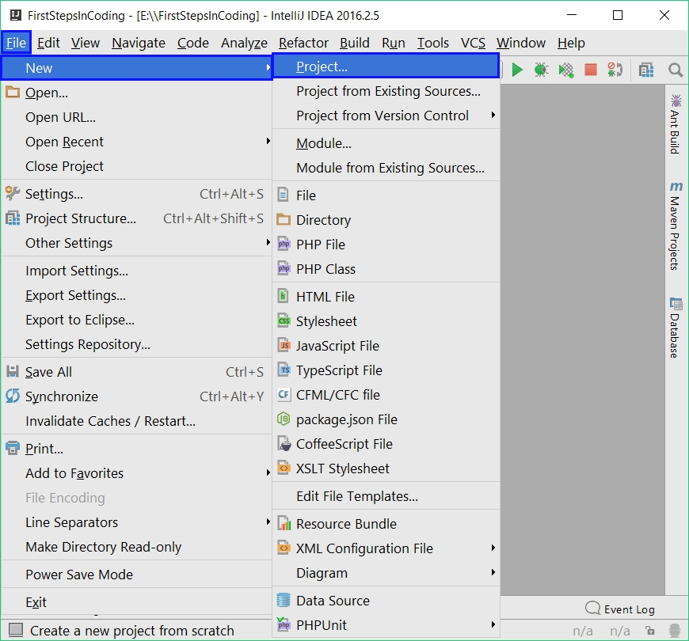

Избираме от диалоговия прозорец [**Java**], в полето Project SDK уточняваме каква версия на Java ще използваме и накрая натискаме бутоните [**Next**] → [**Next**]:

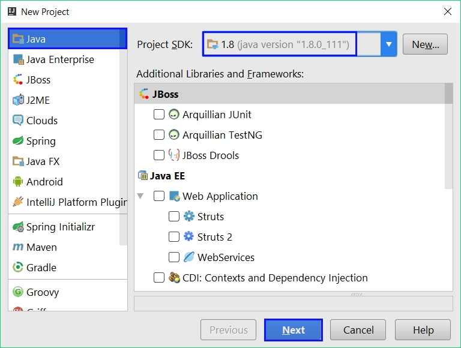

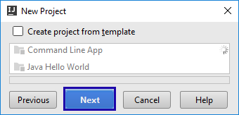

Даваме подходящо име на проекта, например "SimpleCalculations" и също така къде да бъде съхранен нашия проект, след което натискаме бутона [**Finish**]:

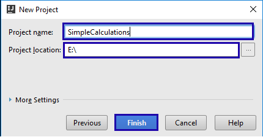

Сега имаме създаден **празен IntelliJ IDEA Project** (без никакви Java класове в него, които трябва да се намират в папката `src`):

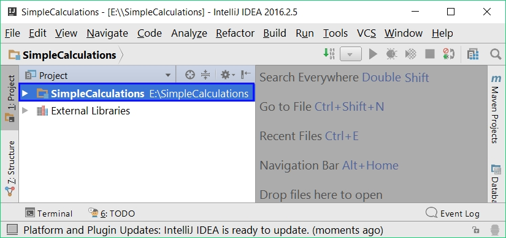

Целта на този project e да добавяме в него **по един `.java` клас за всяка задача** от упражненията.

### Задача:	пресмятане на лице на квадрат

Първата задача от тази тема е следната: да се напише конзолна програма, която **въвежда цяло число `a` и пресмята лицето** на квадрат със страна **`a`**. Задачата е тривиално лесна: **въвеждате число** от конзолата, **умножавате го само по себе си** и **печатате получения резултат** на конзолата.

#### Насоки и подсказки

Създаваме **нов Java клас** в съществуващ IntelliJ IDEA проект. Върху **src** папката кликнете с десен бутон на мишката. Изберете [**New**] → [**Java Class**]:

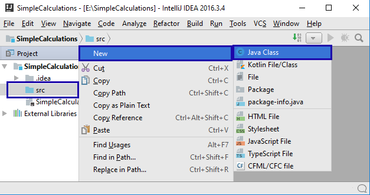

Ще се отвори **диалогов прозорец** за избор на име на Java класа, примерно “SquareArea”:

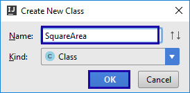

Вече имаме проект с един Java клас в него. Остава да напишем **кода за решаване на задачата**. За целта си дописваме в нашия Java клас `Main` метод(както е показано на картинката) и отиваме в тялото на метода **`Main(string[] args)`**, където пишем следния код между отварящата и затварящата къдрави скоби:

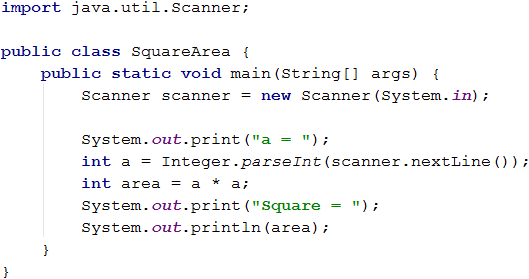

Кодът въвежда цяло число чрез **`a = Integer.parseInt(scanner.nextLine())`**, след това изчислява **`area = a * a`** и накрая печата стойността на променливата **`area`**. **Стартираме** програмата с [**Ctrl+Shft+F10**] и я **тестваме** с различни входни стойности:

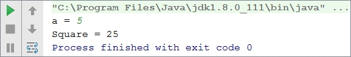

#### Тестване в Judge системата

Тествайте решението си тук: [https://judge.softuni.bg/Contests/Practice/Index/649#0](https://judge.softuni.bg/Contests/Practice/Index/649#0). Трябва да получите 100 точки (напълно коректно решение):

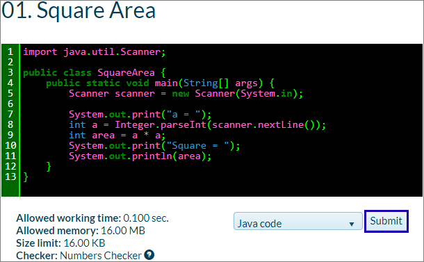

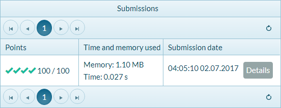


### Задача:	от инчове към сантиметри

Да се напише програма, която **чете от конзолата число** (не непременно цяло) и преобразува числото от **инчове в сантиметри.** За целта **умножава инчовете по 2.54** (тъй като 1 инч = 2.54 сантиметра).

#### Насоки и подсказки

Първо създаваме **нов Java клас** в проекта “SimpleCalculations”. Кликаме с мишката върху папката **src** и избираме [**New**] → [**Java Class**]:

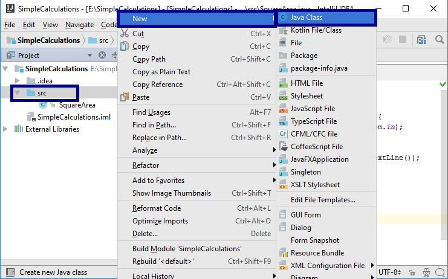

Появява се диалогов прозорец, в който изписваме името на файла. В нашия случай това е "InchesToCentimeters" → [**OK**]:

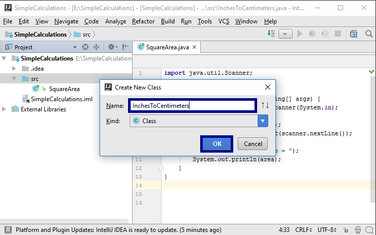

Следва да напишем **кода на програмата**:

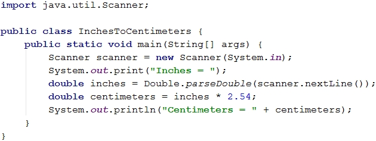

**Стартираме програмата** с десен бутон на мишката върху прозореца на текущата програма. Избираме [**Run InchesToCentim...main()**] или натискаме [**Ctrl+Shift+F10**]. Tази клавишна комбинация стартира програмата в настоящия Java клас (този, в който сме писали последно):

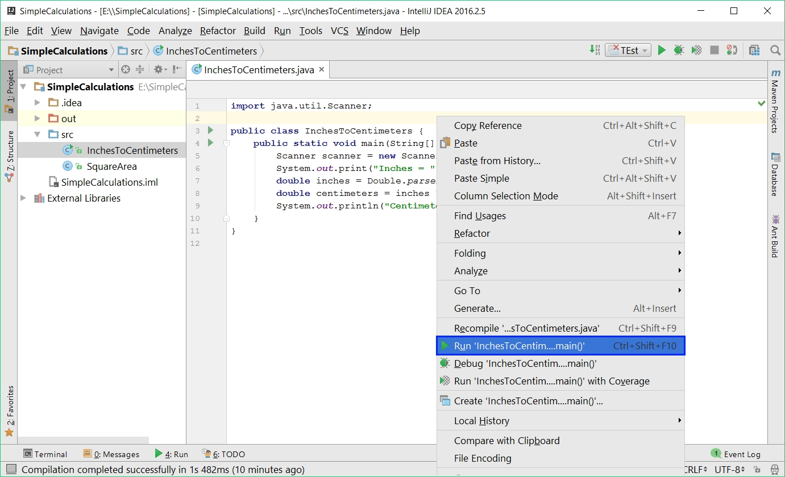

При което получаваме следния резултат:

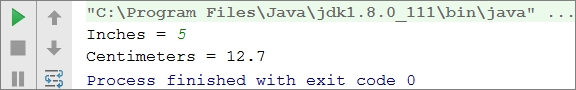

Сега **да превключим към предходната програма/задача** ("лице на квадрат"). Това става с двоен клик на мишката върху файла **`SquareArea.java`** от папката **src** в проекта [**SimpleCalculations**]:

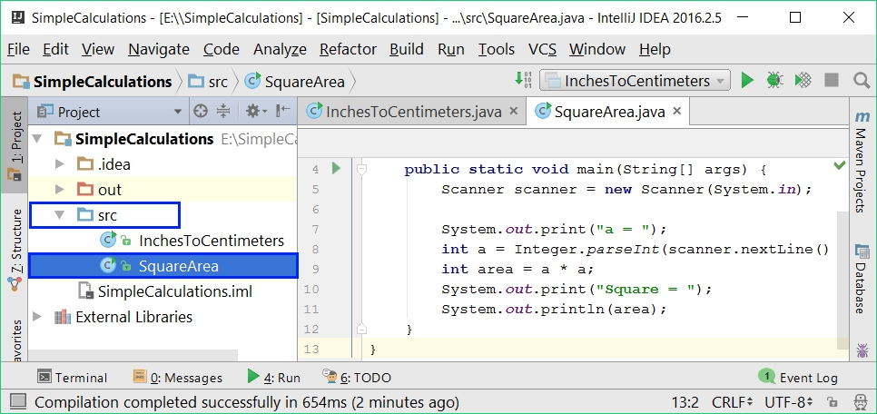

Ако използваме [**Shift+F10**] или натиснем една от двете зелени стрелки (които се намират горе в дясно и долу в ляво на прозореца на IntelliJ IDEA)

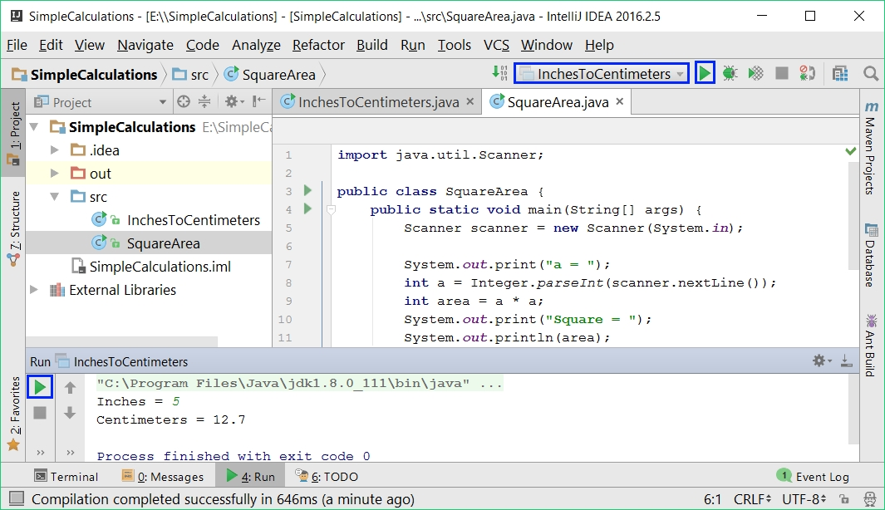

ще се изпълни последно компилираната програма (**InchesToCentimeters**). Нея може да видим като име в горния десен ъгъл на прозореца преди едната зелена стрелка:

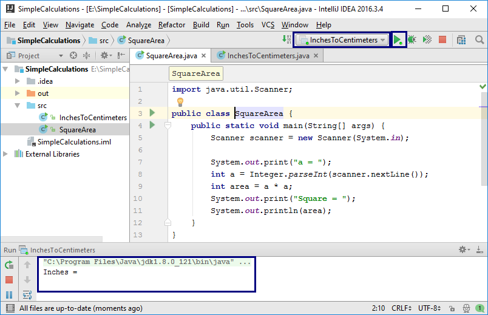

**Превключването между проектите** е много лесно, нали? Просто избираме файла със сорс кода на програмата, кликваме два пъти с мишката върху него и при стартиране тръгва програмата от този файл.

Да тестваме с дробни числа, например с **2.5**:

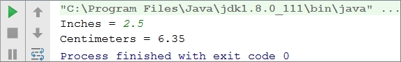

<table><tr><td></td>
<td>В зависимост от регионалните настройки на операционната система, е възможно вместо <b>десетична точка</b> (US настройки) да се използва <b>десетична запетая</b> (BG настройки).</td>
</tr></table>

Ако програмата очаква десетична точка и бъде въведено число с десетична запетая или обратното (бъде въведена десетична точка, когато се очаква десетична запетая), ще се получи следната грешка:

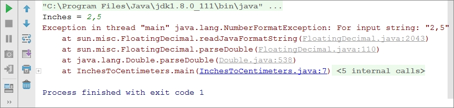

Препоръчително е **да променим настройките на компютъра си**, така че да се използва **десетична точка**:


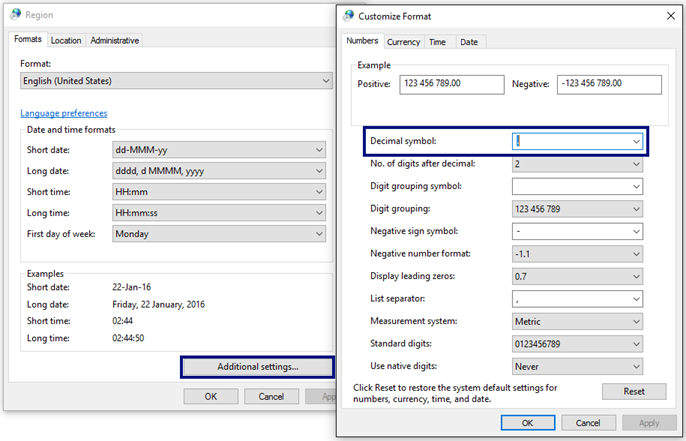

#### Тестване в Judge системата

Тествайте решението си тук: [https://judge.softuni.bg/Contests/Practice/Index/649#1](https://judge.softuni.bg/Contests/Practice/Index/649#1).

Решението би трябвало да бъде прието като напълно коректно:

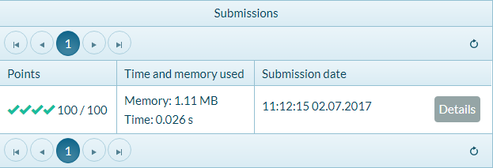


### Задача: поздрав по име

Да се напише програма, която **чете от конзолата име на човек** и отпечатва **`Hello, <name>!`**, където **`<name>`** е въведеното преди това име.

#### Насоки и подсказки

Първо създаваме **нов Java клас** с име “Greeting” в проекта “SimpleCalculations”:

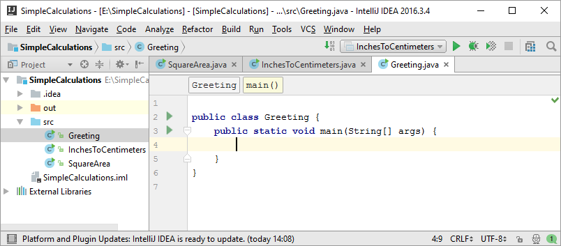

**Следва да напишем кода** на програмата. Ако се затруднявате, може да ползвате примерния код по-долу:

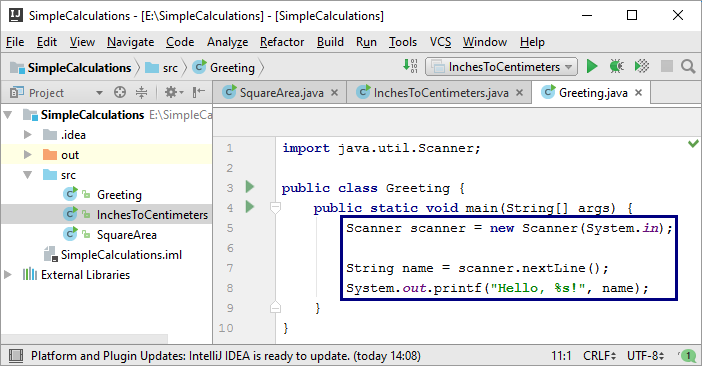

**Стартираме** програмата с [**Ctrl+Shift+F10**] и я тестваме дали работи:


#### Тестване в Judge системата

Тествайте решението си тук:  [https://judge.softuni.bg/Contests/Practice/Index/649#2](hhttps://judge.softuni.bg/Contests/Practice/Index/649#2).


### Задача:	съединяване на текст и числа

Напишете Java програма, който прочита от конзолата име, фамилия, възраст и град и печата съобщение от следния вид: **`You are <firstName> <lastName>, a <age>-years old person from <town>.`**.

#### Насоки и подсказки

Добавяме към текущият IntelliJ IDEA проект още един Java клас с име "`ConcatenateData`".	**Пишем кода**, който чете входните данни от конзолата:

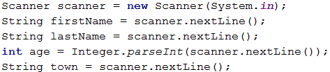

**Кодът**, който отпечатва описаното в условието на задачата съобщение, трябва да се допише.


На горната картинка кодът е нарочно даден замъглен, за да помислите как да си го напишете сами.

Следва да се тества решението локално с [**Ctrl+Shift+F10**] и въвеждане на примерни входни данни.

#### Тестване в Judge системата

Тествайте решението си тук: [https://judge.softuni.bg/Contests/Practice/Index/649#3](https://judge.softuni.bg/Contests/Practice/Index/649#3).


### Задача:	лице на трапец

Напишете програма, която чете от конзолата три числа **b1**, **b2** и **h** и пресмята **лицето на трапец** с основи **b1** и **b2** и височина **h**. Формулата за лице на трапец е **(b1 + b2) * h / 2**.

На фигурата по-долу е показан трапец със страни 8 и 13 и височина 7. Той има лице **(8 + 13) * 7 / 2 = 73.5**.


#### Насоки и подсказки

Отново трябва да добавим към текущия проект в IntelliJ IDEA още един **Java клас** с име "`TrapezoidArea`" и да напишем **кода, който чете входните данни от конзолата, пресмята лицето на трапеца и го отпечатва**:


Кодът на картинката е нарочно размазан, за да помислите върху него и да го допишете сами.

**Тествайте** решението локално с [**Ctrl+Shift+F10**] и въвеждане на примерни данни.

#### Тестване в Judge системата

Тествайте решението си тук: [https://judge.softuni.bg/Contests/Practice/Index/649#4](https://judge.softuni.bg/Contests/Practice/Index/649#4).


### Задача:	периметър и лице на кръг

Напишете програма, която чете от конзолата **число r** и пресмята и отпечатва **лицето и периметъра на кръг**/**окръжност** с **радиус r**.

#### Примерен вход и изход

| Вход  |           Изход                                          |    
|-----|--------------------------------------------------------|
| 3     | Area = 28.2743338823081 <br> Perimeter = 18.8495559215388|
| 4.5   | Area = 63.6172512351933 <br> Perimeter = 28.2743338823081|

#### Насоки и подсказки

За изчисленията можете да използвате следните формули:
-	**`Area = Math.PI * r * r`**.
-	**`Perimeter = 2 * Math.PI * r`**.

#### Тестване в Judge системата

Тествайте решението си тук: [https://judge.softuni.bg/Contests/Practice/Index/649#5](https://judge.softuni.bg/Contests/Practice/Index/649#5).


### Задача: лице на правоъгълник в равнината

**Правоъгълник** е зададен с **координатите** на два от своите срещуположни ъгъла (x1, y1) – (x2, y2). Да се пресметнат **площта и периметъра** му. **Входът** се чете от конзолата. Числата **x1, y1, x2 и y2** са дадени по едно на ред. **Изходът** се извежда на конзолата и трябва да съдържа два реда с по една число на всеки от тях – лицето и периметъра.


#### Примерен вход и изход

|               Вход                        |       Изход         |
|-----------------------------------------|-------------------|
|60<br>20<br>10<br>50                     |1500<br>160         |
|30<br>40<br>70<br>-10                   |2000<br>180         |
|600.25<br>500.75<br>100.50<br>-200.5    |350449.6875<br>2402 |

#### Тестване в Judge системата

Тествайте решението си тук: [https://judge.softuni.bg/Contests/Practice/Index/649#6](https://judge.softuni.bg/Contests/Practice/Index/649#6).


### Задача:	лице на триъгълник

Напишете програма, която чете от конзолата **страна и височина на триъгълник** и пресмята неговото лице. Използвайте **формулата** за лице на триъгълник: **area = a * h / 2**. Закръглете резултата до **2 цифри след десетичния знак, използвайки `Math.round(area * 100.0) / 100.0`**.

#### Примерен вход и изход

|       Вход           |         Изход         |
|--------------------|---------------------|
| 20 <br>30            | Triangle area = 300   |
| 15 <br>35            | Triangle area = 262.5 |
| 7.75 <br>8.45        | Triangle area = 32.74 |
| 1.23456 <br>4.56789  | Triangle area = 2.82  |

#### Тестване в Judge системата

Тествайте решението си тук: [https://judge.softuni.bg/Contests/Practice/Index/649#7](https://judge.softuni.bg/Contests/Practice/Index/649#7).


### Задача:	конзолен конвертор - от градуси °C към градуси °F

Напишете програма, която чете **градуси по скалата на Целзий** (°C) и ги преобразува в **градуси по скалата на Фаренхайт** (°F). Потърсете в Интернет подходяща [формула](http://bfy.tw/3rGh "Търсене в Google"), с която да извършите изчисленията. Закръглете резултата до **2 символа след десетичния знак**. Ето няколко примера:

#### Примерен вход и изход

| Вход | Изход |
|----|-----|
|  25  |   77  |
|   0  |   32  |
| -5.5 |  22.1 |
| 32.3 | 90.14 |

#### Тестване в Judge системата

Тествайте решението си тук: [https://judge.softuni.bg/Contests/Practice/Index/649#8](https://judge.softuni.bg/Contests/Practice/Index/649#8).


### Задача:	конзолен конвертор - от радиани в градуси

Напишете програма, която чете **ъгъл в [радиани](https://bg.wikipedia.org/wiki/Радиан)** (**`rad`**) и го преобразува в **[градуси](https://bg.wikipedia.org/wiki/Градус_(ъгъл))** (`deg`). Потърсете в Интернет подходяща формула. Числото **π** в Java програмите е достъпно чрез **``Math.PI``**. Закръглете резултата до най-близкото цяло число, използвайки метода **``Math.round(…)``**.

#### Примерен вход и изход

|  Вход  | Изход |
|------|-----|
| 3.1416 |  180  |       
| 6.2832 |  360  | 
| 0.7854 |   45  | 
| 0.5236 |   30  |

#### Тестване в Judge системата

Тествайте решението си тук: [https://judge.softuni.bg/Contests/Practice/Index/649#9](https://judge.softuni.bg/Contests/Practice/Index/649#9).


### Задача: конзолен конвертор - USD към BGN

Напишете програма за **конвертиране на щатски долари** (USD) **в български лева** (BGN). **Закръглете** резултата до **2 цифри** след десетичния знак. Използвайте фиксиран курс между долар и лев: **1 USD = 1.79549 BGN**.

#### Примерен вход и изход

|  Вход  |    Изход  |
|------|---------|
|   20   | 35.91 BGN |      
|   100  | 179.55 BGN|
|  12.5  | 22.44 BGN |

#### Тестване в Judge системата

Тествайте решението си тук: [https://judge.softuni.bg/Contests/Practice/Index/649#10](https://judge.softuni.bg/Contests/Practice/Index/649#10).


### Задача:	\* конзолен междувалутен конвертор

Напишете програма за **конвертиране на парична сума от една валута в друга**. Трябва да се поддържат следните валути: **BGN, USD, EUR, GBP**. Използвайте следните фиксирани валутни курсове:

|  Курс  |   USD   |   EUR   |   GBP   |
|:------:|:-------:|:-------:|:-------:|
| 1 BGN  | 1.79549 | 1.95583 | 2.53405 |

**Входът** e **сума за конвертиране**, **входна валута** и **изходна валута**. **Изходът** е едно число – преобразуваната сума по посочените по-горе курсове, закръглен до **2 цифри** след десетичния знак. 

#### Примерен вход и изход

|        Вход        |   Изход  |
|------------------|--------|
|   20<br>USD<br>BGN |35.91 BGN |     
|  100<br>BGN<br>EUR |51.13 EUR | 
| 12.35<br>EUR<br>GBP| 9.53 GBP |  
|150.35<br>USD<br>EUR|138.02 EUR|
 
#### Тестване в Judge системата

Тествайте решението си тук: [https://judge.softuni.bg/Contests/Practice/Index/649#11](https://judge.softuni.bg/Contests/Practice/Index/649#11).


### Задача:	** пресмятане с дати - 1000 дни на Земята

Напишете програма, която въвежда **рождена дата** във формат **`dd-MM-yyyy`** и пресмята датата, на която се навършват **1000 дни** от тази рождена дата и я отпечатва в същия формат.

#### Примерен вход и изход

|   Вход   |	 Изход  |
|--------|--------|
|25-02-1995|21-11-1997|
|07-11-2003|03-08-2006|
|30-12-2002|25-09-2005|
|01-01-2012|27-09-2014|
|14-06-1980|11-03-1983|

#### Насоки и подсказки 
  * Потърсете информация за типовете **`Date`**, **`Calendar`** и **`SimpleDateFormat`** в Java и по-конкретно разгледайте методите **`Calendar.setTime(date)`**, **`Calendar.add(countDays)`** и **`SimpleDateFormat.format(date)`**. С тяхна помощ може да решите задачата, без да е необходимо да изчислявате дни, месеци и високосни години.
  * **Не печатайте** нищо допълнително на конзолата, освен изискваната дата!

#### Тестване в Judge системата

Тествайте решението си тук: [https://judge.softuni.bg/Contests/Practice/Index/649#12](https://judge.softuni.bg/Contests/Practice/Index/649#12).
