# Глава 10. Методи

В настоящата глава ще се запознаем с **методи** и ще научим какво представляват те, както и кои са **базовите концепции** при работа с тях. Ще научим защо е добра практика да ги използваме, как да ги **декларираме** и **извикваме**. Ще се запознаем с **параметри** и **връщана стойност на метод**, както и как да използваме тази връщана стойност. Накрая на главата ще разгледаме **утвърдените практики** при използване на методите.

## Какво е "метод"?

До момента установихме, че при **писане** на код на програма, която решава дадена задача, ни **улеснява** това, че **разделяме** задачата на **части**. Всяка част отговаря за **дадено действие** и по този начин не само ни е **по-лесно** да решим задачата, но и значително се подобрява както **четимостта** на кода, така и проследяването за грешки.

Всяко едно парче код, което изпълнява дадена функционалност и което сме отделили логически, може да изземе функционалността на метода. Точно това представляват **методите – парчета код, които са именувани** от нас по определен начин и които могат да бъдат **извикани** толкова пъти, колкото имаме нужда.

Един метод може да бъде извикан толкова пъти, колкото ние преценим, че ни е нужно за решаване на даден проблем. Това ни **спестява** повторението на един и същи код няколко пъти, както и **намалява** възможността да пропуснем грешка при евентуална корекция на въпросния код.

### Прости методи

**Простите** методи отговарят за изпълнението на дадено **действие**, което **спомага** за решаване на определен проблем. Такива действия могат да бъдат разпечатване на даден низ на конзолата, извършване на някаква проверка, изпълнение на цикъл и др.

Нека разгледаме следния **пример за прост метод**:

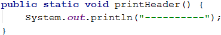

Този метод има задачата да отпечата заглавие, което представлява поредица от символа **`-`**. Поради тази причина името му е **`printHeader`**. Кръглите скоби **`(`** и **`)` винаги** следват името, независимо как сме именували метода. По-късно ще разгледаме как трябва да именуваме методите, с които работим, а за момента ще отбележим само, че е важно *името му да описва действието**, което той извършва.

**Тялото** на метода съдържа **програмния код**, който се намира между къдравите скоби **`{`** и **`}`**. Тези скоби **винаги** следват **декларацията** му и между тях поставяме кода, който решава проблема, описан от името на метода. 

### Защо да използваме методи?

До тук установихме, че методите спомагат за **разделянето на обемна задача на по-малки части**, което води до **по-лесно решаване** на въпросното задание. Това прави програмата ни не само по-добре структурирана и лесно четима, но и по-разбираема.

Чрез методите **избягваме повторението** на програмен код. **Повтарящият** се код е **лоша** практика, тъй като силно **затруднява поддръжката** на програмата и води до грешки. Ако дадена част от кода ни присъства в програмата няколко пъти и се наложи да променим нещо, то промените трябва да бъдат направени във всяко едно повторение на въпросния код. Вероятността да пропуснем място, на което трябва да нанесем корекция, е много голяма, което би довело до некоректно поведение на програмата. Това е причината, поради която е **добра практика**, ако използваме даден фрагмент код **повече от веднъж** в програмата си, да го **дефинираме като отделен метод**. 

Методите ни предоставят **възможността** да използваме даден **код няколко** пъти. С решаването на все повече и повече задачи ще установите, че използването на вече съществуващи методи спестява много време и усилия. 

### Деклариране на методи

В езика Java **декларираме** методите в рамките на даден клас, т.е. между отварящата **`{`** и затваряща **`}`** скоби на класа, но не и в декларацията на друг метод. Декларирането представлява регистрирането на метода в програмата, за да бъде разпознаван в останалата част от нея. Най-добре познатият ни пример за метод е метода **`main(…)`**, който използваме във всяка една програма, която пишем.

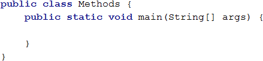

Със следващия пример ще разгледаме задължителните елементи в декларацията на един метод.

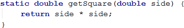

* **Тип на връщаната стойност**. В случая типа е **`double`**, което означава, че методът от примера ще **върне резултат**, който е от тип **`double`**. Връщаната стойност може да бъде както **`int`**, **`double`**, **`String`** и **т.н.**, така и **`void`**. Ако типът е **`void`**, то това означава, че методът **не връща** резултат, а само **изпълнява дадено действие**.
* **Име на метода**. Името на метода е **определено от нас**, като не забравяме, че трябва да **описва функцията**, която е изпълнявана от кода в тялото му. В примера името е **`GetSquare`**, което ни указва, че задачата на този метод е да изчисли лицето на квадрат.
* **Списък с параметри**. Декларира се между скобите **`(`** и **`)`**, които изписваме след името му. Тук изброяваме поредицата от **параметри**, които метода ще използва. Може да присъства **само един** параметър, **няколко** такива или да е **празен** списък. Ако няма параметри, то ще запишем само скобите **`()`**. В конкретния пример декларираме параметъра **`side`** от тип **`double`**.
* Декларация **`static`** в описанието на метода. За момента може да приемем, че **`static`** се пише винаги, когато се декларира метод, а по-късно, когато се запознаем с обектно-ориентираното програмиране (ООП), ще разберем разликата между **статични методи** (споделени за целия клас) и **методи на обект**, които работят върху данните на конкретна инстанция на класа (обект).

При деклариране на методи е важно да спазваме **последователността** на основните му елементи - първо **ключовата дума `static`**, следвана от **тип на връщаната стойност**, след това **име на метода** и накрая **списък от параметри**, ограден с кръгли скоби **`()`**.

След като сме декларирали метода, следва неговата **имплементация (тяло)**. В тялото на метода описваме **алгоритъма**, по който той решава даден проблем, т.е. тялото съдържа кода (програмен блок), който реализира **логиката** на метода. В показания пример изчисляваме лицето на квадрат, а именно **`side * side`**. 

Когато декларираме дадена променлива в тялото на един метод, я наричаме **локална** променлива за метода. Областта, в която съществува и може да бъде използвана тази променлива, започва от реда, на който сме я декларирали и стига до затварящата къдрава скоба **`}`** на тялото на метода. Тази област се нарича **област на видимост** на променливата (variable scope). 

### Извикване на методи

Извикването на метод представлява **стартирането на изпълнението на кода**, който се намира в **тялото на метода**. Това става като изпишем **името** му, последвано от кръглите скоби **`()`** и знака **`;`** за край на реда. Ако методът ни изисква входни данни, то те се подават в скобите **`()`**, като последователността на фактическите параметри трябва да съвпада с последователността на подадените при декларирането на метода. Ето един пример:

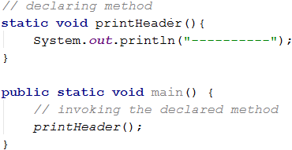

Даден метод може да бъде извикан от **няколко места** в нашата програма. Единият начин е да бъде извикан от **главния метод**.

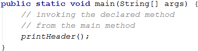

Метод може да бъде извикан и от **тялото на друг метод**, който **не** е главния метод на програмата ни.

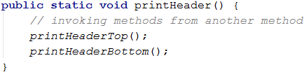

Съществува вариант методът да бъде извикан от **собственото си тяло**. Това се нарича **рекурсия** и можете да намерите повече информация за нея в [Wikipedia](https://bg.wikipedia.org/wiki/%D0%A0%D0%B5%D0%BA%D1%83%D1%80%D1%81%D0%B8%D1%8F) или да потърсите сами в Интернет.

Важно е да знаем, че ако един метод е деклариран в даден клас, то той може да бъде извикван преди реда, на който е деклариран.

### Пример: празна касова бележка

Да се напише метод, който печата празна касова бележка. Методът трябва да извиква други три метода: един за принтиране на заглавието, един за основната част на бележката и един за долната част.

|Част от касовата бележка|Текст|
|---|---|
|Горна част|CASH RECEIPT<br>------------------------------|
|Средна част|Charged to\_\_\_\_\_\_\_\_\_\_\_\_\_\_\_\_\_\_\_\_<br>Received by\_\_\_\_\_\_\_\_\_\_\_\_\_\_\_\_\_\_\_|
|Долна част|------------------------------<br>(c) SoftUni|

#### Примерен вход и изход

|Вход|Изход|
|---|---|
|(няма)|CASH RECEIPT<br>------------------------------<br>Charged to\_\_\_\_\_\_\_\_\_\_\_\_\_\_\_\_\_\_\_\_<br>Received by\_\_\_\_\_\_\_\_\_\_\_\_\_\_\_\_\_\_\_<br>------------------------------<br>(c) SoftUni|

#### Насоки и подсказки

Първата ни стъпка е да създадем **`void`** метод за **принтиране на заглавната част** от касовата бележка (header). Нека му дадем смислено име, което описва кратко и ясно задачата му, например **`printReceiptHeader`**. В тялото му ще напишем кода от примера по-долу:

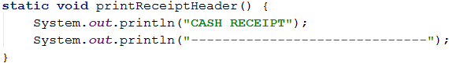

Съвсем аналогично ще създадем още два метода **за разпечатване на средната част** на бележката (тяло) **`printReceiptBody`** и **за разпечатване на долната част** на бележката (footer) **`printReceiptFooter`**.

След това ще създадем и **още един метод**, който ще извиква трите метода, които написахме до момента един след друг:

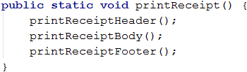

Накрая ще **извикаме** метода **`printReceipt`** от тялото на главния **`main`** метод за нашата програма:

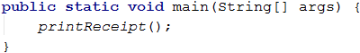

#### Тестване в Judge системата

Програмата с общо пет метода, които се извикват един от друг, е готова и можем **да я изпълним и тестваме**, след което да я пратим за проверка в judge системата: [https://judge.softuni.bg/Contests/Practice/Index/665#0](https://judge.softuni.bg/Contests/Practice/Index/665#0).


## Методи с параметри

Много често в практиката, за да бъде решен даден проблем, методът, с чиято помощ постигаме това, се нуждае от **допълнителна информация**, която зависи от задачата му. Именно тази информация представляват **параметрите на метода** и неговото поведение зависи от тях. 

### Използване на параметри в методите

Както отбелязахме по-горе, **параметрите освен нула на брой, могат също така да са един или няколко**. При декларацията им ги разделяме със запетая. Те могат да бъдат от всеки един тип (**`int`**, **`String`** и т.н.), а по-долу е показан пример как точно ще бъдат използвани от метода.

**Декларираме** метода и **списъка** му с **параметри**, след което пишем кода, който той ще изпълнява.

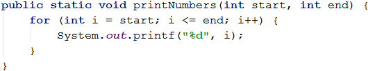

След това **извикваме** метода и му **подаваме конкретни стойности**:

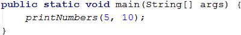

При **декларирането на параметри** можем да използваме **различни** типове променливи, като трябва да внимаване всеки един параметър да има **тип** и **име**. Важно е да отбележим, че при последващото извикване на метода, трябва да подаваме **стойности** за параметрите по **реда**, в който са **декларирани** самите те. Ако имаме подадени параметри в реда **`int`** и след това **`String`**, при извикването му не можем да подадем първо стойност за **`String`** и след това за **`int`**. 

Нека разгледаме примера за декларация на метод, който има няколко параметъра от различен тип.

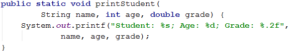

### Пример: знак на цяло число

Да се създаде метод, който печата знака на цяло число n.

#### Примерен вход и изход

|Вход|Изход|
|---|---|
|2|The number 2 is positive.|
|-5|The number -5 is negative.|
|0|The number 0 is zero.|

#### Насоки и подсказки

Първата ни стъпка е **създаването** на метод и даването му на описателно име, например **`printSign`**. Този метод ще има само един параметър от тип **`int`**. 

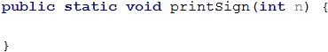

Следващата ни стъпка е **имплементирането** на логиката, по която програмата ни ще проверява какъв точно е знакът на числото. От примерите виждаме, че има три случая: числото е по-голямо от нула, равно на нула или по-малко от нула, което означава, че ще направим три проверки в тялото на метода. 

Следващата ни стъпка е да прочетем входното число и да извикаме новия метод от тялото на **`main`** метода.

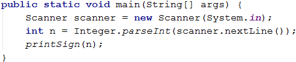

#### Тестване в Judge системата

Тествайте решението си тук: [https://judge.softuni.bg/Contests/Practice/Index/665#1](https://judge.softuni.bg/Contests/Practice/Index/665#1).


### Пример: принтиране на триъгълник

Да се създаде метод, който принтира триъгълник, както е показано в примерите.

#### Примерен вход и изход

|Вход|Изход|Вход|Изход|
|---|---|---|---|
|3|1<br>1 2<br>1 2 3<br>1 2<br>1|4|1<br>1 2<br>1 2 3<br>1 2 3 4 <br>1 2 3<br>1 2<br>1|

#### Насоки и подсказки

Преди да създадем метод за принтиране на един ред с дадени начало и край, прочитаме входното число от конзолата. След това избираме смислено име за метода, което описва целта му, например **`printLine`**, и го имплементираме.

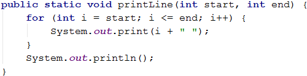

От задачите за рисуване на конзолата си спомняме, че е добра практика **да разделяме фигурата на няколко части**. За наше улеснение ще разделим триъгълника на три части - горна, средна линия и долна.

Следващата ни стъпка е с цикъл да разпечатаме **горната половина** от триъгълника:

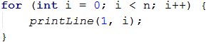

След това разпечатваме **средната линия**:


Накрая разпечатваме **долната част** от триъгълника, като този път стъпката на цикъла намалява.

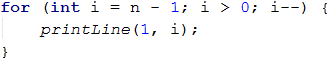

#### Тестване в Judge системата

Тествайте решението си тук: [https://judge.softuni.bg/Contests/Practice/Index/665#2](https://judge.softuni.bg/Contests/Practice/Index/665#2).


### Пример: рисуване на запълнен квадрат

Да се нарисува на конзолата запълнен квадрат със страна n, както е показно в примерите.

#### Примерен вход и изход

|Вход|Изход|Вход|Изход|
|---|---|---|---|
|4|<code>--------</code><br><code>-\\/\\/\\/-</code><br><code>-\\/\\/\\/-</code><br><code>--------</code>|5|<code>----------</code><br><code>-\\/\\/\\/\\/-</code><br><code>-\\/\\/\\/\\/-</code><br><code>-\\/\\/\\/\\/-</code><br><code>----------</code>|

#### Насоки и подсказки

Първата ни стъпка е да прочетем входа от конзолата. След това трябва да създадем метод, който ще принтира първия и последен ред, тъй като те са еднакви. Нека не забравяме, че трябва да му дадем **описателно име** и да му зададем като **параметър** дължината на страната. Ще използваме конструктора **`new String`**. 

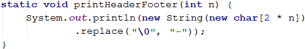

Следващата ни стъпка е да създадем метод, който ще рисува на конзолата средните редове. Отново задаваме описателно име, например **`printMiddleRow`**.

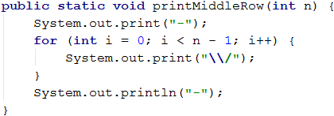

Накрая извикваме създадените методи в главния метод **`main()`** на програмата, за да нарисуваме целия квадрат:

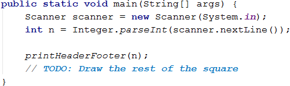

#### Тестване в Judge системата

Тествайте решението си тук: [https://judge.softuni.bg/Contests/Practice/Index/665#3](https://judge.softuni.bg/Contests/Practice/Index/665#3).


## Връщане на резултат от метод

До момента разгледахме методи, които извършват дадено действие, например отпечатване на даден текст, число или фигура на конзолата. Освен този тип методи, съществуват и такива, които могат да **връщат** някакъв **резултат**. Именно тези методи ще разгледаме в следващите редове.

### Типове на връщаната от метода стойност

До сега разглеждахме примери, в които при декларация на методи използвахме ключовата дума **`void`**, която указва, че методът **не** връща резултат, а изпълнява определено действие.

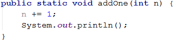

Ако **заместим** **`void`** с **тип** на променлива, то това ще укаже на програмата, че метода трябва да върне някаква стойност от указания тип. Тази върната стойност може да бъде от всякакъв тип – **`int`**, **`String`**, **`double`** и т.н. 

<table><tr><td>
</td><td>За да върне един метод <strong>резултат</strong> е нужно да внимаваме да напишем очаквания тип на резултата при декларацията на метода на мястото на <code>void</code>.</td></tr>
</table>

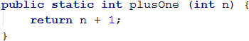

Важно е да отбележим, че **резултатът**, който се връща от метода, може да е от **тип, съвместим с типа на връщаната стойност** на метода. Например, ако декларираният тип на връщаната стойност е **`double`**, то можем да върнем резултат от тип **`int`**.

### Оператор return

За да получим резултат от метода, на помощ идва операторът **`return`**. Той трябва да бъде **използван в тялото** на метода и указва на програмата да **спре изпълнението** му и да **върне** на извиквача на метода определена **стойност**, която се определя от израза след въпросния оператор **`return`**.

В примера по-долу имаме метод, който взима име и фамилия, съединява ги и ги връща като резултат. Връщаната стойност е от тип **`String`**:

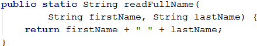

Операторът **`return`** може да бъде използван и във **`void`** методи. Тогава самият метод ще спре изпълнението си, без да връща никаква стойност, а след него не трябва да има израз, който да бъде върнат. В този случай употребата на **`return`** е единствено за излизане от метода.

**Има случаи**, в които **`return`** може да бъде извикван от няколко места в метода, но само ако има **определени** входни условия.

В примера по-долу имаме метод, който сравнява две числа и връща резултат съответно **`-1`**, **`0`** или **`1`** според това дали първият аргумент е по-малък, равен или по-голям от втория аргумент, подаден на функцията. Методът използва ключо-вата дума **`return`** на три различни места, за да върне три различни стойности според логиката на сравненията на числата:

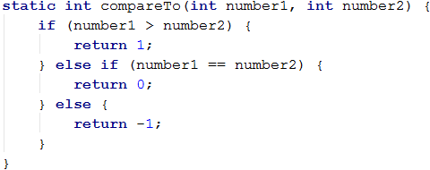

#### Кодът след return е недостъпен

След **`return`** операторa, в текущия блок, **не** трябва да има други редове код, тъй като тогава IntelliJ IDEA ще покаже грешка, че е засякъл код, който **не може да бъде достъпен**:

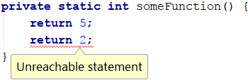

<table><tr><td>
</td><td>В програмирането не може да има два пъти оператор <code><b>return</b></code> един след друг, защото изпълнението на първия няма да позволи да се изпълни вторият. Понякога програмистите се шегуват с фразата “<b><i>пиши</i> <code>return; return;</code> <i>и да си ходим</i></b>”, за да обяснят, че логиката на програмата е объркана.</td></tr>
</table>

### Употреба на връщаната от метода стойност

След като даден метод е изпълнен и върне стойност, то тази стойност може да се използва по **няколко** начина.

Първият е да **присвоим резултата като стойност на променлива** от съвместим тип:

```java
int max = getMax(5, 10);
```

Вторият е резултатът да бъде използван **в израз**:

```java
double total = getPrice() * quantity * 1.2;
```

Третият е да **подадем** резултата от работата на метода към **друг метод**:

```java
Scanner scanner = new Scanner(System.in);
int age = Integer.parseInt(scanner.nextLine());
```

### Пример: пресмятане на лицето на триъгълник

Да се напише метод, който изчислява лицето на триъгълник по дадени основа и височина и връща стойността му.

#### Примерен вход и изход

|Вход|Изход|
|---|---|
|3<br>4|6|

#### Насоки и подсказки

Първата ни стъпка е да прочетем входа. След това **създаваме** метод, но този път внимаваме при **декларацията** да подадем коректния **тип** данни, които искаме метода да върне, а именно **`double`**.

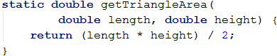

Следващата ни стъпка е да **извикаме новия** метод от нашия **`main()`** метод и да **запишем върнатата стойност в подходяща променлива**.

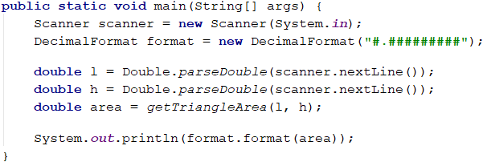

#### Тестване в Judge системата

Тествайте решението си тук: [https://judge.softuni.bg/Contests/Practice/Index/665#4](https://judge.softuni.bg/Contests/Practice/Index/665#4).


### Пример: степен на число

Да се напише метод, който изчислява и връща резултата от повдигането на число на дадена степен.

#### Примерен вход и изход

|Вход|Изход|Вход|Изход|
|---|---|---|---|
|2<br>8|256|3<br>4|81|

#### Насоки и подсказки

Първата ни стъпка отново ще е да прочетем входните данни от конзолата. Следващата стъпка е да създадем метод, който ще приема два параметъра (числото и степента) и ще връща като резултат число от тип **`double`**.

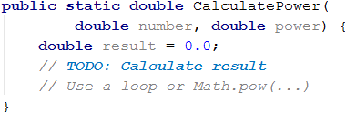

След като сме направили нужните изчисления, ни остава да разпечатаме резултата в главния метод **`main()`** на програмата.

#### Тестване в Judge системата

Тествайте решението си тук: [https://judge.softuni.bg/Contests/Practice/Index/665#5](https://judge.softuni.bg/Contests/Practice/Index/665#5).


## Варианти на методи

В много езици за програмиране един и същ метод може да е деклариран в **няколко варианта** с еднакво име и различни параметри. Това е известно с термина “**method overloading**”. Сега нека разгледаме как се пишат тези overloaded methods.

### Сигнатура на метода

В програмирането **начинът**, по който се **идентифицира** един метод, е чрез **двойката елементи** от декларацията му – **име** на метода и **списък** от неговите параметри. Тези два елемента определят неговата **спецификация**, т. нар. **сигнатура** на метода. 

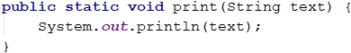

В този пример сигнатурата на метода е неговото име (**`print`**), както и неговият параметър (**`String text`**).

Ако в програмата ни има **методи с еднакви имена**, но с **различни сигнатури**, то казваме, че имаме **варианти на методи (method overloading)**.

### Варианти на методи

Както споменахме, ако използваме **едно и също име за няколко метода с различни сигнатури**, то това означава, че имаме **варианти на метод**. Кодът по-долу показва как три различни метода могат да са с едно и също име, но да имат различни сигнатури и да изпълняват различни действия.

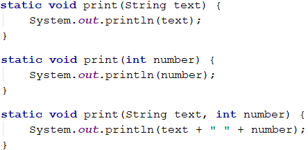

### Сигнатура и тип на връщаната стойност

Важно е да отбележим, че **връщаният тип като резултат** на метода **не е част от сигнатурата му**. Ако връщаната стойност беше част от сигнатурата на метода, то няма как компилаторът да знае кой метод точно да извика.

Нека разгледаме следния пример - имаме два метода с различен тип на връщаната стойност. Въпреки това IntelliJ IDEA ни показва, че има грешка, защото сигнатурите и на двата са еднакви. Съответно при опит за извикване на метод с име **`print()`**, компилаторът не би могъл да прецени кой от двата метода да изпълни.

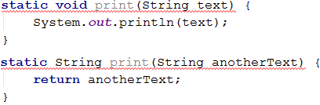

### Пример: по-голямата от две стойности

Като входни данни са дадени две стойности от един и същ тип. Стойностите могат да са от тип **`int`**, **`char`** или **`String`**. Да се създаде метод **`getMax()`**, който връща като резултат по-голямата от двете стойности.

#### Примерен вход и изход

|Вход|Изход|Вход|Изход|Вход|Изход|
|---|---|---|---|---|---|
|int<br>2<br>16|16|char<br>a<br>z|z|string<br>Ivan<br>Todor|Todor|

#### Насоки и подсказки

За да създадем този метод, първо трябва да създадем три други метода с едно и също име и различни сигнатури. Първо създаваме метод, който ще сравнява цели числа.

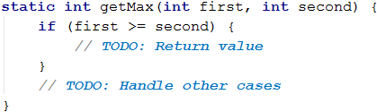

Следвайки логиката от предходния метод, създаваме такъв със същото име, който обаче ще сравнява символи.

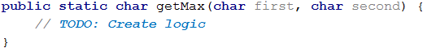

Следващият метод, който трябва да създадем, ще сравнява низове. Тук логиката ще е малко по-различна, тъй като стойностите от тип **`String`** не позволяват да бъдат сравнявани чрез операторите **`<`** и **`>`**. Ще използваме метода **`compareTo(…)`**, който връща числова стойност: по-голяма от 0 (сравняваният обект е по-голям), по-малка от 0 (сравняваният обект е по-малък) и 0 (при два еднакви обекта).

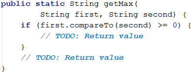

Последната стъпка е да прочетем входните данни, да използваме подходящи променливи и да извикаме метода **`getMax()`** от тялото на метода **`main()`**.

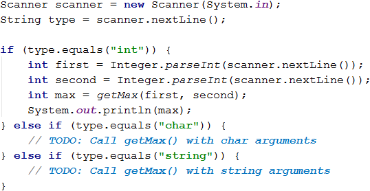

#### Тестване в Judge системата

Тествайте решението си тук: [https://judge.softuni.bg/Contests/Practice/Index/665#6](https://judge.softuni.bg/Contests/Practice/Index/665#6).


## Именуване на методи. Добри практики при работа с методи

В тази част ще се запознаем с някои **утвърдени практики** при работа с методи, свързани с именуването, подредбата на кода и неговата структура.

### Именуване на методи

Когато наименуваме даден метод е препоръчително да използваме **смислени имена**. Тъй като всеки метод **отговаря** за някаква част от нашия проблем, то при наименуването му трябва да вземем предвид **неговата функция**, т.е. добра практика е **името да описва неговата цел**. 

Задължително е името да започва с **малка буква** и трябва да е съставено от глагол или от двойка: глагол + съществително име. Форматирането на името става, спазвайки **Lower Case Camel** конвенцията, т.е. **първата дума започва с малка буква, а всяка следваща започва с главна буква**. Кръглите скоби **`( `** и **`)`** винаги следват името му. 

Всеки метод трябва да изпълнява самостоятелна задача, а името на метода трябва да описва каква е неговата функция. 

Няколко примера за **коректно** именуване на методи:
* **`findStudent`**
*	**`loadReport`**
*	**`sine`**

Няколко примера за **лошо** именуване на методи:
*	**`Method1`**
*	**`DoSomething`**
*	**`HandleStuff`**
*	**`SampleMethod`**
*	**`DirtyHack`**

Ако не можем да измислим подходящо име, то най-вероятно методът решава повече от една задача или няма ясно дефинирана цел и тогава трябва да помислим как да го разделим на няколко отделни метода.

### Именуване на параметрите на методите

При именуването на **параметрите** на метода важат почти същите правила, както и при самите методи. Разликите тук са, че за имената на параметрите е добре да използваме съществително име или двойка от прилагателно и съществително име, както и че при именуване на параметрите също се спазва **`lowerCamelCase`** конвенцията. Трябва да отбележим, че е добра практика името на параметъра да **указва** каква е **мерната единица**, която се използва при работа с него.

Няколко примера за **коректно** именуване на параметри на методи:
* **`firstName`**
*	**`report`**
*	**`speedKmH`**
*	**`usersList`**
*	**`fontSizeInPixels`**
*	**`font`**

Няколко примера за **некоректно** именуване на параметри:
*	**`p`**
*	**`p1`**
*	**`p2`**
* **`populate`**
* **`LastName`**
* **`last_name`**

### Добри практики при работа с методи

Нека отново припомним, че един метод трябва да изпълнява **само една** точно определена **задача**. Ако това не може да бъде постигнато, тогава трябва да помислим как да **разделим** метода на няколко отделни такива. Както казахме, името на метода трябва точно и ясно да описва неговата цел. Друга добра практика в програмирането е да **избягваме** методи, по-дълги от екрана ни (приблизително). Ако все пак кода стане много обемен, то е препоръчително метода да се **раздели** на няколко по-кратки, както в примера по-долу.


### Структура и форматиране на кода

При писането на методи трябва да внимаваме да спазваме коректна **индентация** (отместване по-навътре на блокове от кода).

Пример за **правилно** форматиран Java код:

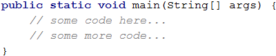

Пример за **некоректно** форматиран Java код:

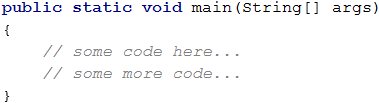

Когато заглавният ред на метода е **твърде дълъг**, се препоръчва той да се раздели на няколко реда, като всеки ред след първия се отмества с две табулации надясно (за по-добра четимост):


Друга добра практика при писане на код е да **оставяме празен ред** между методите, след циклите и условните конструкции. Също така, опитвайте да **избягвате** да пишете **дълги редове и сложни изрази**. С времето ще установите, че това подобрява четимостта на кода и спестява време. 

Препоръчваме винаги да се **използват къдрави скоби за тялото на проверки и цикли**. Скобите не само подобряват четимостта, но и намалят възможността да бъде допусната грешка и прогрaмата ни да се държи некоректно.

## Какво научихме от тази глава?

В тази глава се запознахме с базовите концепции при работа с методи:
* Научихме, че **целта** на методите е да **разделят** големи програми с много редове код на по-малки и кратки задачи.
* Запознахме се със **структурата** на методите, как да ги **декларираме** и **извикваме** по тяхното име. 
* Разгледахме примери за методи с **параметри** и как да ги използваме в нашата програма.
* Научихме какво представляват **сигнатурата** и **връщаната стойност** на метода, както и каква е функцията на оператора **`return`** в методите.
* Запознахме се с **добрите практики** при работа с методи, как да именуваме методите и техните параметри, как да форматираме кода и други.


## Упражнения

За да затвърдим работата с методи, ще решим няколко задачи. В тях се изисква да напишете метод с определена функционалност и след това да го извикате като му подадете данни, прочетени от конзолата, точно както е показано в примерния вход и изход.

### Задача: "Hello, Име!"

Да се напише метод, който получава като параметър име и принтира на конзолата "*Hello, \<name\>!*".

#### Примерен вход и изход

|Вход|Изход|
|---|---|
|Peter|Hello, Peter!|

#### Насоки и подсказки

Дефинирайте метод **`printName(string name)`** и го имплементирайте, след което в главната програма прочетете от конзолата име на човек и извикайте метода като му подадете прочетеното име.

#### Тестване в Judge системата

Тествайте решението си тук: [https://judge.softuni.bg/Contests/Practice/Index/665#7](https://judge.softuni.bg/Contests/Practice/Index/665#7).


### Задача: по-малко число

Да се създаде метод **`getMin(int a, int b)`**, който връща по-малкото от две числа. Да се напише програма, която чете като входни данни от конзолата три числа и печата най-малкото от тях. Да се използва метода **`getMin(…)`**, който е вече създаден.

#### Примерен вход и изход

|Вход|Изход|Вход|Изход|
|---|---|---|---|
|1<br>2<br>3|1|-100<br>-101<br>-102|-102|

#### Насоки и подсказки

Дефинирайте метод **`getMin(int a, int b)`** и го имплементирайте, след което го извикайте от главната програма както е показано по-долу. За да намерите минимума на три числа, намерете първо минимума на първите две от тях и след това минимума на резултата и третото число:

```java
int min = getMin(getMin(num1, num2), num3);
```

#### Тестване в Judge системата

Тествайте решението си тук: [https://judge.softuni.bg/Contests/Practice/Index/665#8](https://judge.softuni.bg/Contests/Practice/Index/665#8).


### Задача: повтаряне на низ

Да се напише метод **`repeatString(str, count)`**, който получава като параметри променлива от тип **`String`** и цяло число **`n`** и връща низа, повторен **`n`** пъти. След това резултатът да се отпечата на конзолата.

#### Примерен вход и изход

|Вход|Изход|Вход|Изход|
|---|---|---|---|
|str<br>2|strstr|roki<br>6|rokirokirokirokirokiroki|

#### Насоки и подсказки

Допишете метода по-долу като добавите съединяването входния низ към резултата в цикъла:

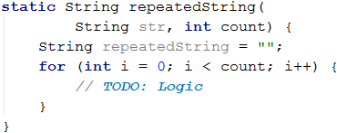

Имайте предвид, че в езика Java съединяването на низове в цикъл води до лоша производителност и не се препоръчва. Потърсете и пробвайте по-ефективни решения тук: https://stackoverflow.com/questions/1235179.

#### Тестване в Judge системата

Тествайте решението си тук: [https://judge.softuni.bg/Contests/Practice/Index/665#9](https://judge.softuni.bg/Contests/Practice/Index/665#9).


### Задача: n-та цифра

Да се напише метод **`findNthDigit(number, index)`**, който получава число и индекс N като параметри и печата N-тата цифра на числото (като се брои от дясно на ляво, започвайки от 1). След това, резултатът да се отпечата на конзолата.

#### Примерен вход и изход

|Вход|Изход|Вход|Изход|Вход|Изход|
|---|---|---|---|---|---|
|83746<br>2|4|93847837<br>6|8|2435<br>4|2|

#### Насоки и подсказки

За да изпълним алгоритъма, ще използваме **`while`** цикъл, докато дадено число не стане 0. На всяка итерация на **`while`** цикъла ще проверяваме дали настоящият индекс на цифрата не отговаря на индекса, който търсим. Ако отговаря, ще върнем като резултат цифрата на индекса (**`number % 10`**). Ако не отговаря, ще премахнем последната цифра на числото (**`number = number / 10`**). Трябва да следим коя цифра проверяваме по индекс (от дясно на ляво, започвайки от 1). Когато намерим цифрата, ще върнем индекса. 

#### Тестване в Judge системата

Тествайте решението си тук: [https://judge.softuni.bg/Contests/Practice/Index/665#10](https://judge.softuni.bg/Contests/Practice/Index/665#10).


### Задача: число към бройна система

Да се напише метод **`integerToBase(number, toBase)`**, който получава като параметри цяло число и основа на бройна система и връща входното число, конвертирано към посочената бройна система. След това, резултатът да се отпечата на конзолата. Входното число винаги ще е в бройна система 10, а параметърът за основа ще е между 2 и 10.

#### Примерен вход и изход

|Вход|Изход|Вход|Изход|Вход|Изход|
|---|----|---|---|---|---|
|3<br>2|11|4<br>4|10|9<br>7|12|

#### Насоки и подсказки

За да решим задачата, ще декларираме стрингова променлива, в която ще пазим резултата. След това трябва да изпълним следните изчисления, нужни за конвертиране на числото.
* Изчисляваме **остатъка** от числото, разделено на основата.
* **Вмъкваме остатъка** от числото в началото на низа, представящ резултата.
* **Разделяме** числото на основата.
* **Повтаряме** алгоритъма, докато входното число не стане 0.

Допишете липсващата логика в метода по-долу:

```java
static String integerToBase(int number, int toBase) {
    String result = "";
    while (number != 0) {
        // Implement the missing conversion logic
    }
    return result;
}
```

#### Тестване в Judge системата 

Тествайте решението си тук: [https://judge.softuni.bg/Contests/Practice/Index/665#11](https://judge.softuni.bg/Contests/Practice/Index/665#11).


### Задача: известия

Да се напише програма, която прочита цяло число **`n`** и на следващите редове въвежда **`n`** **съобщения** (като за всяко съобщение се прочитат по няколко реда). Всяко съобщение започва с **`messageType`**: **`success`**, **`warning`** или **`error`**:
   - Когато **`messageType`** е **`success`** да се четат **`operation`** + **`message`** (всяко на отделен ред).
   - Когато **`messageType`** е **`warning`** да се чете само **`message`**.
   - Когато **`messageType`** е **`error`** да се четат **`operation`** + **`message`** + **`errorCode`** (всяко на отделен ред).

На конзолата да се отпечата **всяко прочетено съобщение**, форматирано в зависимост от неговия **`messageType`**. Като след заглавния ред за всяко съобщение да се отпечатат толкова на брой символа **`=`**, **колкото е дълъг** съответният **заглавен ред** и да се сложи по един **празен ред** след всяко съобщение (за по-детайлно разбиране погледнете примерите). 

Задачата да се реши с дефиниране на четири метода: **`showSuccessMessage()`**, **`showWarningMessage()`**, **`showErrorMessage()`** и **`readAndProcessMessage()`**, като само последният метод да се извиква от главния **`main()`** метод:

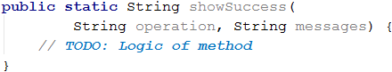

#### Примерен вход и изход

|Вход|Изход|
|---|---|
|4<br>error<br>credit card purchase<br>Invalid customer address<br>500<br>warning<br>Email not confirmed<br>success<br>user registration<br>User registered successfully<br>warning<br>Customer has not email assigned|<code>Error: Failed to execute credit card purchase.</code><br><code>==============================================</code><br><code>Reason: Invalid customer address.</code><br><code>Error code: 500.</code><br><br><code>Warning: Email not confirmed.</code><br><code>=============================</code><br><br><code>Successfully executed user registration.</code><br><code>========================================</code><br><code>User registered successfully.</code><br><br><code>Warning: Customer has not email assigned.</code><br><code>=========================================</code>|

#### Насоки и подсказки

Дефинирайте и имплементирайте посочените четири метода.

В **`readAndProcessMessage()`** прочетете типа съобщение от конзолата и според прочетения тип прочетете останалите данни (още един два или три реда). След това извикайте съответния метод за печатане на съответния тип съобщение.

Ако четете от конзолата от няколко отделни метода, имайте предвид, че трябва **да създадете `Scanner` обект само веднъж** (например в главния метод) и да го предавате към другите методи като параметър. Създаването на няколко **`Scanner`** обекта, които четат от конзолата, може да не работи както очаквате.

#### Тестване в Judge системата

Тествайте решението си тук: [https://judge.softuni.bg/Contests/Practice/Index/665#12](https://judge.softuni.bg/Contests/Practice/Index/665#12).


### Задача: числа към думи

Да се напише метод **`letterize(number)`**, който прочита цяло число и го разпечатва с думи на английски език според условията по-долу:
* Да се отпечатат с думи стотиците, десетиците и единиците (и евентуални минус) според правилата на английския език.
* Ако числото е по-голямо от **999**, трябва да се принтира "**too large**".
* Ако числото е по-малко от **-999**, трябва да се принтира "**too small**".
* Ако числото е **отрицателно**, трябва да се принтира "**minus**" преди него.
* Ако числото не е съставено от три цифри, не трябва да се принтира.

#### Примерен вход и изход

|Вход|Изход|Вход|Изход|
|---|---|---|---|
|3<br>999<br>-420<br>1020|nine-hundred and ninety nine<br>minus four-hundred and twenty<br>too large|2<br>15<br>350|fifteen<br>three-hundred and fifty|

|Вход|Изход|Вход|Изход|
|---|---|---|---|
|4<br>311<br>418<br>509<br>-9945|three-hundred and eleven<br>four-hundred and eighteen<br>five-hundred and nine<br>too small|3<br>500<br>123<br>9|five-hundred<br>one-hundred and twenty three<br>nine|

#### Насоки и подсказки

Можем първо да отпечатаме **стотиците** като текст - (числото / 100) % 10, след тях **десетиците** - (числото / 10) % 10 и накрая **единиците** - (числото % 10).

Първият специален случай е когато числото е точно **закръглено на 100** (напр. 100, 200, 300 и т.н.). В този случай отпечатваме "one-hundred", "two-hundred", "three-hundred" и т.н.

Вторият специален случай е когато числото, формирано от последните две цифри на входното число, е **по-малко от 10** (напр. 101, 305, 609 и т.н.). В този случай отпечатваме "one-hundred and one", "three-hundred and five", "six-hundred and nine" и т.н.

Третият специален случай е когато числото, формирано от последните две цифри на входното число, е **по-голямо от 10 и по-малко от 20** (напр. 111, 814, 919 и т.н.). В този случай отпечатваме "one-hundred and eleven", "eight-hundred and fourteen", "nine-hundred and nineteen" и т.н.

#### Тестване в Judge системата

Тествайте решението си тук: [https://judge.softuni.bg/Contests/Practice/Index/665#13](https://judge.softuni.bg/Contests/Practice/Index/665#13).


### Задача: криптиране на низ

Да се напише метод **`encrypt(char letter)`**, който криптира дадена буква по следния начин:
* Вземат се първата и последна цифра от ASCII кода на буквата и се залепят една за друга в низ, който ще представя резултата. 
* Към началото на стойността на низа, който представя резултата, се залепя символа, който отговаря на следното условие:
  * ASCII кода на буквата + последната цифра от ASCII кода на буквата.
* След това към края на стойността на низа, който представя резултата, се залепя символа, който отговаря на следното условие:
  * ASCII кода на буквата - първата цифра от ASCII кода на буквата.
* Методът трябва да върне като резултат криптирания низ.

Пример:
* j &rarr; **p16i**
  * ASCII кодът на **j** e **106** &rarr; Първа цифра - **1**, последна цифра - **6**.
  * Залепяме първата и последната цифра &rarr; **16**.
  * Към **началото** на стойността на низа, който представя резултата, залепяме символа, който се получава от сбора на ASCII кода + последната цифра &rarr; 106 + 6 &rarr; 112 &rarr; **p**.
  * Към **края** на стойността на низа, който представя резултата, залепяме символа, който се получава от разликата на ASCII кода - първата цифра &rarr; 106 - 1 &rarr; 105 &rarr; **i**.
  
Използвайки метода, описан по-горе, да се напише програма, която чете **поредица от символи**, **криптира ги** и отпечатва резултата на един ред.

Приемаме, че входните данни винаги ще бъдат валидни. Главният метод трябва да прочита входните данни, подадени от потребителя – цяло число **`n`**, следвани от по един символ на всеки от следващите **`n`** реда.

Да се криптират символите и да се добавят към криптирания низ. Накрая като резултат трябва да се отпечата **криптиран низ от символи** като в следващия пример.

Пример:
* S, o, f, t, U, n, i &rarr; V83Kp11nh12ez16sZ85Mn10mn15h

#### Примерен вход и изход

|Вход|Изход|
|---|---|
|7<br>S<br>o<br>f<br>t<br>U<br>n<br>i| V83Kp11nh12ez16sZ85Mn10mn15h |

|Вход|Изход| 
|---|---|
|7<br>B<br>i<br>r<br>a<br>H<br>a<br>x| H66<n15hv14qh97XJ72Ah97xx10w |

#### Насоки и подсказки
На променливата от тип **`String`**, в която ще се пази стойността на резултата, ще присвоим първоначална стойност **`String str = ""`** (Empty String / празен стринг). Трябва да се завърти цикъл **`n`** пъти, като на всяка итерация към променливата, в която пазим стойността на резултата, ще прибавяме криптирания символ. 

За да намерим първата и последната цифри от ASCII кода, ще използваме алгоритъма, който използвахме за решаване на задача "Число към бройна система".

#### Тестване в Judge системата

Тествайте решението си тук: [https://judge.softuni.bg/Contests/Practice/Index/665#14](https://judge.softuni.bg/Contests/Practice/Index/665#14).
